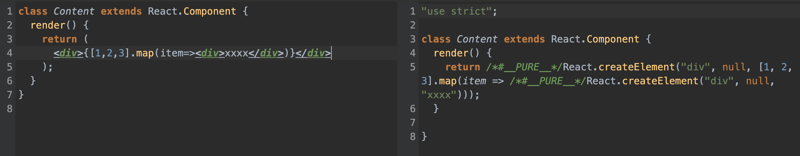
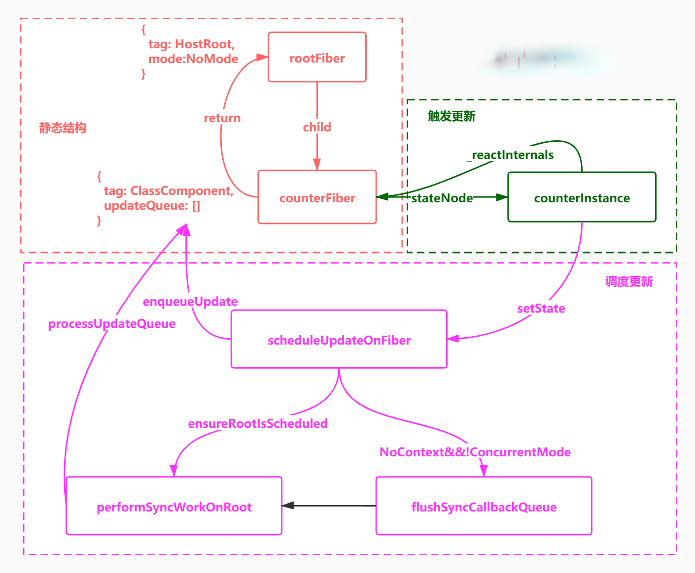
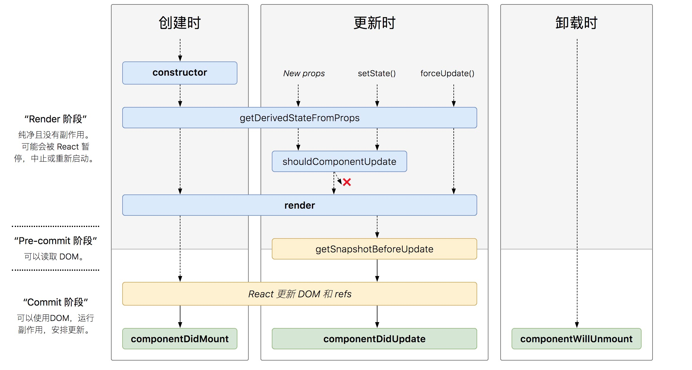
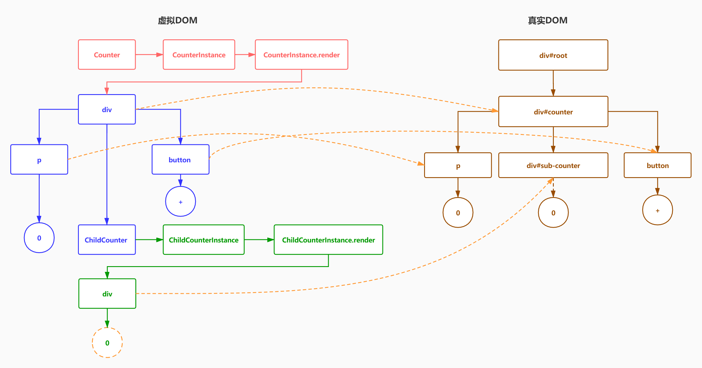

<!--
 * @Author: cc
 * @LastEditTime: 2021-11-05 10:21:21
-->

### React jsx 语法基于 Babel 解析

<br/>



```javaScript

// 真实Dom
 <div className="box" style={{color:'red'}}>
   内容
  <span>1</span>
  <p>2</p>
</div>

// 转换结果
 {
  type:"div",
  props:{
    className:"box"
  },
 "内容"
  children:[{
    type:"span",
    props:{
      style:{
        color:"red"
      },
      children:"hello"
    },
  },{
    type:"p",
    props:null,
    children:"2"
  }]
}
```

### React

1. React 元素不可变,不可以改变元素类型，例如{type:h1}修改为{type:h2}，禁止修改对象属性 Object.freeze(object)，其实就是改变 writeable 属性为 false

2. React 元素采用局部更新，只更新可变部分，domDiff

### 函数组件

1. 自定义组件必须是首字母大写 原生组件小写开头，自定义组件大写字母开头

2. 组件必须使用前先定义

3. 组件必须返回并且只能返回一个根元素

### 合成事件和批量更新

<br/>



1. 在 React 中，事件的更新可能是异步的，是批量的，例如同时触发多个 setState

2. 调用 setState 状态并没有立刻更新，而是先缓存起来

3. 等事件处理函数执行完毕之后，再进行批量更新，一次更新并重新渲染

4. 因为 jsx 是由 React 函数控制，只要归 React 控制就是批量，只要不归 react 管，就是非批量

```javaScript
    this.setState({number:this.state.number+1});
    console.log(this.state.number); // 0
    this.setState({number:this.state.number+1});
    console.log(this.state.number); // 0
        // 第一个参数，获取最新的state
    // 第二个参数，可以传入函数，获取最新的state
    this.setState((lastState)=>{number:lastState.number+1},()=>{
        console.log(this.state.number) // 1
    })
     this.setState((lastState)=>{number:lastState.number+1},()=>{
        console.log(this.state.number) // 1
    })
    Promise.resolve().then(()=>{
        console.log(this.state.number); // 2
        this.setState({number:this.state.number+1});
        console.log(this.state.number); // 3
        sthis.etState({number:this.state.number+1});
        console.log(this.state.number); // 4
    })

```

### react 生命周期

<br/>



### domDiff


