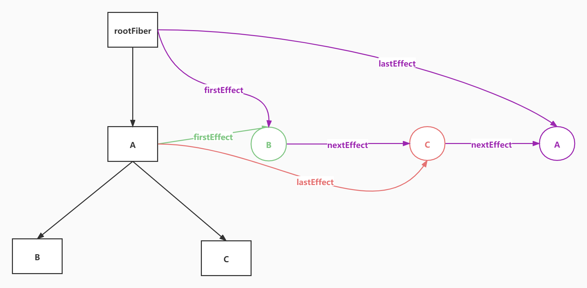
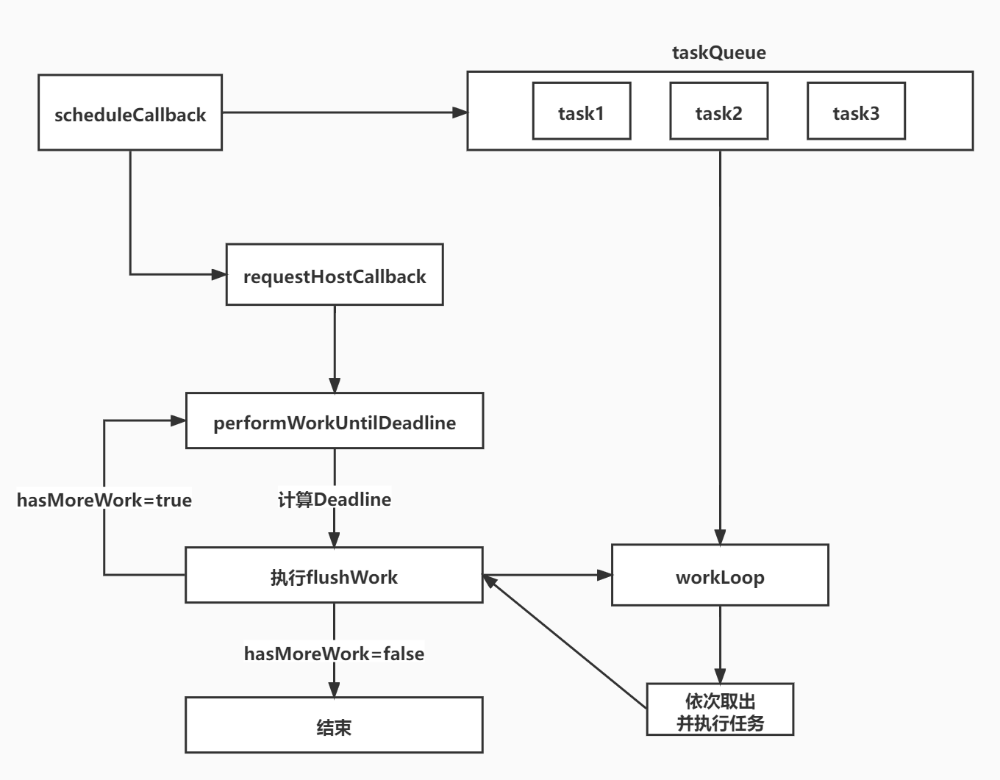
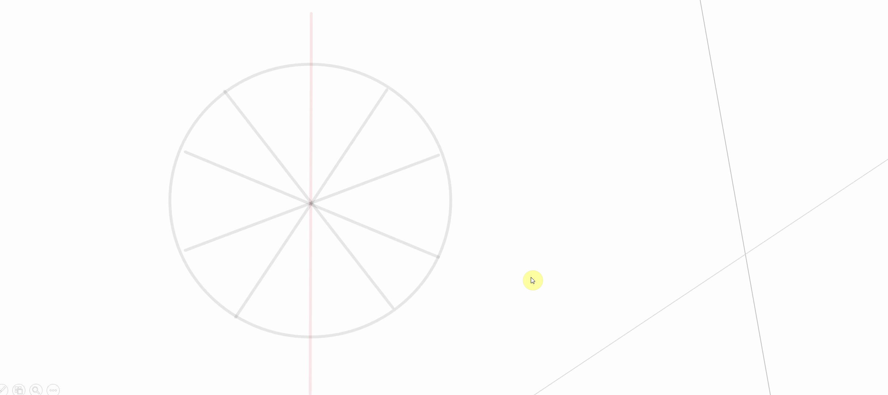
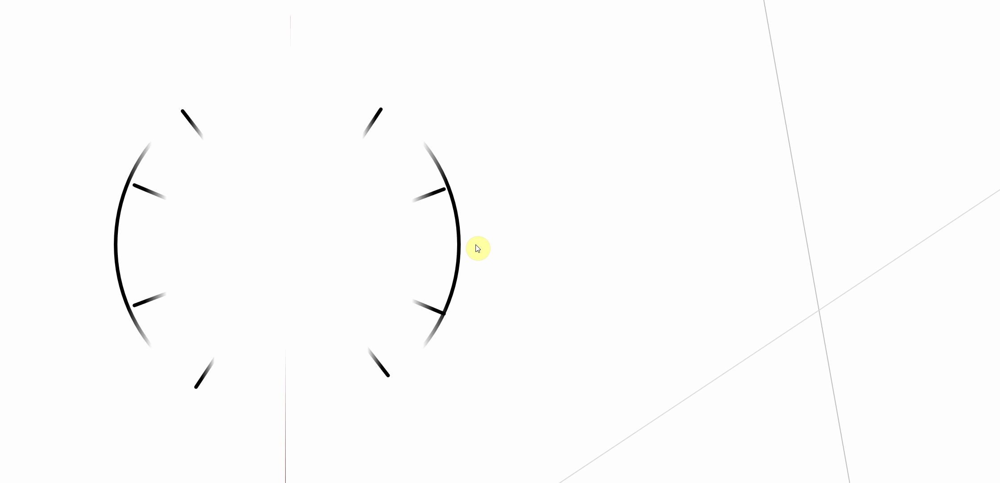
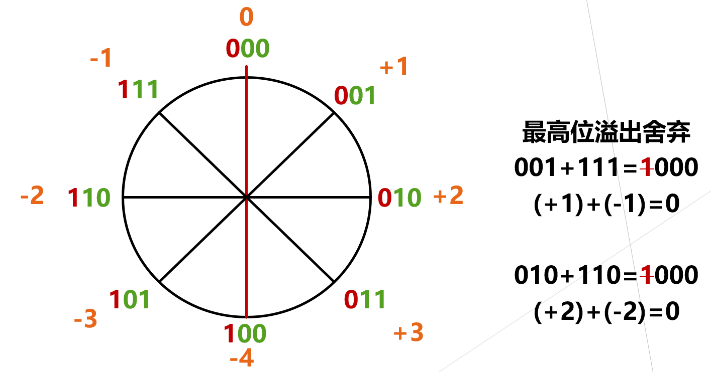
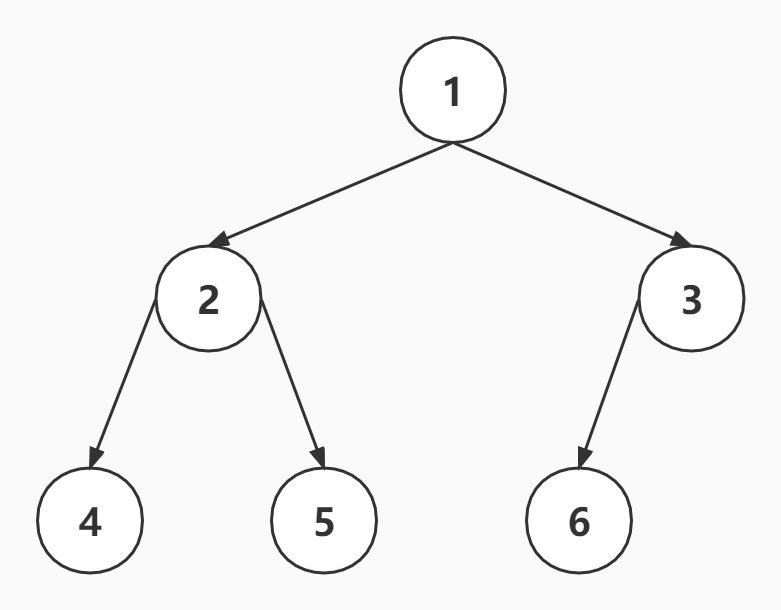

<!--
 * @Author: cc
 * @LastEditTime: 2023-02-06 21:20:23
-->
### React架构

1.**Scheduler**（调度器）—— 调度任务的优先级，高优任务优先进入Reconciler

2.**Reconciler**（协调器）—— 负责找出变化的组件

3.**Renderer**（渲染器）—— 负责将变化的组件渲染到页面上

<br/>

React是用**javaScript**构建快速响应的大型web应用的首选方式，何为快速响应？

当遇到大量操作计算或者设备性能产生的页面掉帧导致卡顿，发送网络请求后，由于需要等待数据返回才能进一步操作导致不能快速响应，这两类场景可以概括为**CPU**的瓶颈和**IO**的瓶颈，react如何解决？

在浏览器每一帧的时间中，预留一些时间给JS线程，React利用这部分时间更新组件（可以看到，在源码 (opens new window)中，预留的初始时间是5ms）
ƒ
这种将长任务分拆到每一帧中，像蚂蚁搬家一样一次执行一小段任务的操作，被称为时间切片（time slice）

IO的瓶颈如何解决,需要将**同步的更新**变为**可中断的异步更新**

<br/>

### React 工作循环


<br/>

### beginWork

当首屏渲染时，调用begingWork，同时通过root.current创建新的workInProgress，然后判断workInProgress !== null，while循环调用performUnitOfWork，performUnitOfWork当中开始进行beginWork，beginWork执行完毕，将新属性同步到老属性上面，unitOfWork.memoizedProps = unitOfWork.pendingProps，

beginWork的作用就是通过当前的Fiber创建子fiber，建立fiber链，根节点调用updateHostRoot，此时current和workInProgress一定会同时存在，调用reconcileChildren函数，传入current和workInProgess，，此时current !== null,直接走更新逻辑，通过reconcileSingleElement直接进行单节点的dom diff，因为首次child为null，调用createFiberFromElement通过jsx创建fiber节点，然后通过created.return = returnFiber，建立父子关系，返回created，执行完毕，返回workInProgress.child，

然后进行深度优先遍历,接下来因为一般render函数的第一个参数为函数组件，此时函数组件并没有alternate属性，所以current为空，设置**didReceiveUpdate**为false,**didReceiveUpdate**用来判断fiber是否有变化，通过pendingProps和memoizedProps比较来赋值didReceiveUpdate，在mount时FunctionComponent是按indeterminate处理的，调用mountIndeterminateComponent，取pendingProps，调用RenderWithHooks，判断current是否为null，调用HooksDispatcherOnMount或者HooksDispatcherOnUpdate，直接调用component函数，获取jsx对象，返回jsx对象，然后调用reconcileChildren对象，传入null，走初次渲染逻辑，初次渲染走插入逻辑，也就是将flags设置为2，走Placement逻辑，接着通过beingWork返回的的next，判断是否为Null，不为Null赋值workInProgress，循环performUnitOfWork逻辑，当next为null时，递的mount流程结束，调用completeUnitOfWork，完成第一个fiber节点，通过return和sibling，往上走到root。


### completeWork

首次渲染调用completeWork时，alternate为null，拿到newProps，也就是workInProgress的pendingProps，判断workInProgress.tag，如果为HostComponent，通过判断current和workInProgress.stateNode区分是更新还是初始化，初始化逻辑调用createInstance创建实例，由于是深度优先遍历，当workInProgress进行归阶段时，也就意味着其子树的dom节点已创建，所以只需将子树中离instance最近的dom节点追加到instance上即可，调用finalizeInitialChildren，初始化instance，也就是dom的属性，然后通过return和sibling向上初始化，完成之后，获取root.current.alternate，也就是workInProgress，设置为root.finishedWork，调用commitRoot。


### commitRoot

核心实现在于遍历副作用链表，实现更新逻辑

**commitBeforeMutationEffects** dom 变更之前, 主要处理副作用队列中带有Snapshot,Passive标记的fiber节点

**commitMutationEffects** dom 变更, 界面得到更新. 主要处理副作用队列中带有Placement, Update, Deletion, Hydrating标记的fiber节点

**commitLayoutEffects** dom 变更后, 主要处理副作用队列中带有Update | Callback标记的fiber节点

<br/>

### collectEffectList

作为DOM操作的依据，commit阶段需要找到所有有effectTag的Fiber节点并依次执行effectTag对应操作。难道需要在commit阶段再遍历一次Fiber树寻找effectTag !== null的Fiber节点么？

这显然是很低效的。

为了解决这个问题，在completeWork的上层函数completeUnitOfWork中，每个执行完completeWork且存在effectTag的Fiber节点会被保存在一条被称为effectList的单向链表中。

effectList中第一个Fiber节点保存在fiber.firstEffect，最后一个元素保存在fiber.lastEffect。

类似appendAllChildren，在“归”阶段，所有有effectTag的Fiber节点都会被追加在effectList中，最终形成一条以rootFiber.firstEffect为起点的单向链表。

这样，在commit阶段只需要遍历effectList就能执行所有effect了。



```javaScript

  function collectEffectList(returnFiber, completedWork) {
    if (returnFiber) {
      //如果父亲 没有effectList,那就让父亲 的firstEffect链表头指向自己的头
      if (!returnFiber.firstEffect) {
        returnFiber.firstEffect = completedWork.firstEffect;
      } 
      //如果自己有链表尾
      if (completedWork.lastEffect) {
        //并且父亲也有链表尾
        if (returnFiber.lastEffect) {
          //把自己身上的effectlist挂接到父亲的链表尾部
          returnFiber.lastEffect.nextEffect = completedWork.firstEffect;
        }
        returnFiber.lastEffect = completedWork.lastEffect;
      }
      var flags = completedWork.flags; //如果此完成的fiber有副使用，那么就需要添加到effectList里
      if (flags) {
        //如果父fiber有lastEffect的话，说明父fiber已经有effect链表
        if (returnFiber.lastEffect) {
          returnFiber.lastEffect.nextEffect = completedWork;
        } else {
          returnFiber.firstEffect = completedWork;
        }

        returnFiber.lastEffect = completedWork;
      }
    }
  }
  let rootFiber = { key: 'rootFiber' };
  let fiberA = { key: 'A', flags: Placement };
  let fiberB = { key: 'B', flags: Placement };
  let fiberC = { key: 'C', flags: Placement };
  //B把自己的fiber给A
  collectEffectList(fiberA, fiberB);
  collectEffectList(fiberA, fiberC);
  collectEffectList(rootFiber, fiberA);  //rootFiber->A-B->C 
  
```

### Fiber数据结构

Fiber有FiberRoot和普通Fiber节点，这里展示的普通Fiber节点

```javaScript
type Fiber = {
   /**
   * 该fiber节点处于同级兄弟节点的第几位
   */
  index: number
  /**
   * 此次commit中需要删除的fiber节点
   */
  deletions: Fiber[] | null
  /**
   * 子树带有的更新操作，用于减少查找fiber树上更新的时间复杂度
   */
  subtreeFlags: Flags
  /**
   *一个Bitset代表该fiber节点上带有的更新操作,比如第二位为1就代表该节点需要插入
   */
  flags: Flags
  /**
   * 新创建jsx对象的第二个参数,像HostRoot这种内部自己创建的Fiber节点为null
   */
  pendingProps: any
  /**
   * 上一轮更新完成后的props
   */
  memoizedProps: any
  /**
   *其子节点为单链表结构child指向了他的第一个子节点后续子节点可通过child.sibling获得
   */
  child: Fiber | null

  /**
   * 该fiber节点的兄弟节点，他们都有着同一个父fiber节点
   */
  sibling: Fiber | null
  /**
   * 在我们的实现中只有Function组件对应的fiber节点使用到了该属性
   * function组件会用他来存储hook组成的链表,在react中很多数据结构
   * 都有该属性，注意不要弄混了
   */
  memoizedState: any
  /**
   * 该fiber节点对于的相关节点(类组件为为类实例，dom组件为dom节点)
   */
  stateNode: any

  /**
   * 存放了该fiber节点上的更新信息,其中HostRoot,FunctionComponent, HostComponent
   * 的updateQueue各不相同，函数的组件的updateQueue是一个存储effect的链表
   * 比如一个函数组件内有若干个useEffect，和useLayoutEffect，那每个effect
   * 就会对应这样的一个数据结构
   * {
   *  tag: HookFlags //如果是useEffect就是Passive如果是useLayoutEffect就是Layout
   *  create: () => (() => void) | void //useEffect的第一个参数
   *  destroy: (() => void) | void //useEffect的返回值
   *  deps: unknown[] | null //useEffect的第二个参数
   *  next: Effect
   * }
   * 各个effect会通过next连接起来
   * HostComponent的updateQueue表示了该节点所要进行的更新，
   * 比如他可能长这样
   * ['children', 'new text', 'style', {background: 'red'}]
   * 代表了他对应的dom需要更新textContent和style属性
   */
  updateQueue: unknown  // 存储effect的链表

  /**
   * 表示了该节点的类型，比如HostComponent,FunctionComponent,HostRoot
   * 详细信息可以查看react-reconciler\ReactWorkTags.ts
   */
  tag: WorkTag

  /**
   * 该fiber节点父节点（以HostRoot为tag的fiber节点return属性为null）
   */
  return: Fiber | null

  /**
   * 该节点链接了workInPrgress树和current fiber树之间的节点
   */
  alternate: Fiber | null 

  /**
   * 用于多节点children进行diff时提高节点复用的正确率
   */
  key: string | null

  /**
   * 如果是自定义组件则该属性就是和该fiber节点关联的function或class
   * 如果是div,span则就是一个字符串
   */
  type: any

  /**
   * 表示了元素的类型，fiber的type属性会在reconcile的过程中改变，但是
   * elementType是一直不变的，比如Memo组件的type在jsx对象中为
   * {
   *  $$typeof: REACT_MEMO_TYPE,
   *  type,
   *  compare: compare === undefined ? null : compare,
   * }
   * 在经过render阶段后会变为他包裹的函数，所以在render前后是不一致的
   * 而我们在diff是需要判断一个元素的type有没有改变，
   * 以判断能不能复用该节点，这时候elementType就派上用场
   * 了，因为他是一直不变的
   */
  elementType: any

  /**
   * 描述fiber节点及其子树属性BitSet
   * 当一个fiber被创建时他的该属性和父节点一致
   * 当以ReactDom.render创建应用时mode为LegacyMode，
   * 当以createRoot创建时mode为ConcurrentMode
   */
  mode: TypeOfMode

  /**
   * 用来判断该Fiber节点是否存在更新，以及改更新的优先级
   */
  lanes: Lanes
  /**
   * 用来判断该节点的子节点是否存在更新
   */
  childLanes: Lanes
};
```
<br/>

### Fiber双缓存树

1.react根据双缓冲机制维护了两个fiber树，因为更新时依赖于老状态的

current Fiber树：用于渲染页面

workinProgress Fiber树：用于在内存构建中，方便在构建完成后直接替换current Fiber树

2.Fiber双缓存

首次渲染时：
render阶段会根据jsx对象生成新的Fiber节点，然后这些Fiber节点会被标记成带有‘Placement’的副作用，说明他们是新增节点，需要被插入到真实节点中，在commitWork阶段就会操作成真实节点，将它们插入到dom树中。

页面触发更新时
render阶段会根据最新的jsx生成的虚拟dom和current Fiber树进行对比，比较之后生成workinProgress Fiber(workinProgress Fiber树的alternate指向Current Fiber树的对应节点，这些Fiber会带有各种副作用，比如‘Deletion’、‘Update’、'Placement’等)这一对比过程就是diff算法

当workinProgress Fiber树构建完成，workInprogress 则成为了curent Fiber渲染到页面上

diff ⽐较的是什么？ ⽐较的是 current fiber 和 vdom，⽐较之后⽣成 workInprogress Fiber

## 

<br/>

### DomDiff

DomDiff 的过程其实就是老的 Fiber 树 和 新的 jsx 对比生成新的 Fiber 树 的过程，分为单节点和多节点两种分别对应**reconcileSingleElement**和**reconcileChildrenArray**

**只对同级元素进行比较**

**不同的类型对应不同的元素**

**可以通过key来标识同一个节点**

### 单节点

  1.新旧节点 type 和 key 都不一样，标记为删除

  2.如果对比后发现新老节点一样的，那么会复用老节点，复用老节点的 DOM 元素和 Fiber 对象
  再看属性有无变更 ，如果有变化，则会把此 Fiber 节点标准为更新

  3.如果 key 相同，但是 type 不同，则不再进行后续对比了，
  直接把老的节点全部删除


```javaScript

  function reconcileSingleElement(
    returnFiber: Fiber,
    currentFirstChild: Fiber | null,
    element: ReactElement
  ): Fiber {
    const key = element.key;
    let child = currentFirstChild;
    // 首先判断是否存在对应DOM节点
    while (child !== null) {
      // 上一次更新存在DOM节点，接下来判断是否可复用
      // 首先比较key是否相同
      if (child.key === key) {
        // key相同，接下来比较type是否相同
        switch (child.tag) {
          // ...省略case
          default: {
            if (child.elementType === element.type) {
              // type相同则表示可以复用
              // 删除剩下的兄弟节点
               deleteRemainingChildren(returnFiber, child.sibling)
               // 复用fiber，更新props
               const existing = useFiber(child, element.props)
               existing.return = returnFiber
               return existing
            }
            //key相同但是type变了，直接停止遍历，把后面的节点都删了
            deleteRemainingChildren(returnFiber, child)
            break
          }
        }
        // 代码执行到这里代表：key相同但是type不同
        // 将该fiber及其兄弟fiber标记为删除
        deleteRemainingChildren(returnFiber, child);
        break;
      } else {
        // key不同，将该fiber标记为删除
        deleteChild(returnFiber, child);
      }
      child = child.sibling;
    }
    //一个都不能复用，直接重新创建一个，根据jsx创建fiber节点
    const created = createFiberFromElement(element, returnFiber.mode, lanes)
    // 建立与父级的关系
    created.return = returnFiber
    return created
  }
  
```

### 多节点

```javaScript

  // 之前
  abcd
  // 之后
  acdb
  
  ===第一轮遍历开始===
  a（之后）vs a（之前）  
  key不变，可复用
  此时 a 对应的oldFiber（之前的a）在之前的数组（abcd）中索引为0
  所以 lastPlacedIndex = 0;

  继续第一轮遍历...

  c（之后）vs b（之前）  
  key改变，不能复用，跳出第一轮遍历
  此时 lastPlacedIndex === 0;
  ===第一轮遍历结束===

  ===第二轮遍历开始===
  newChildren === cdb，没用完，不需要执行删除旧节点
  oldFiber === bcd，没用完，不需要执行插入新节点

  将剩余oldFiber（bcd）保存为map

  // 当前oldFiber：bcd
  // 当前newChildren：cdb

  继续遍历剩余newChildren

  key === c 在 oldFiber中存在
  const oldIndex = c（之前）.index;
  此时 oldIndex === 2;  // 之前节点为 abcd，所以c.index === 2
  比较 oldIndex 与 lastPlacedIndex;

  如果 oldIndex >= lastPlacedIndex 代表该可复用节点不需要移动
  并将 lastPlacedIndex = oldIndex;
  如果 oldIndex < lastplacedIndex 该可复用节点之前插入的位置索引小于这次更新需要插入的位置索引，代表该节点需要向右移动

  在例子中，oldIndex 2 > lastPlacedIndex 0，
  则 lastPlacedIndex = 2;
  c节点位置不变

  继续遍历剩余newChildren

  // 当前oldFiber：bd
  // 当前newChildren：db

  key === d 在 oldFiber中存在
  const oldIndex = d（之前）.index;
  oldIndex 3 > lastPlacedIndex 2 // 之前节点为 abcd，所以d.index === 3
  则 lastPlacedIndex = 3;
  d节点位置不变

  继续遍历剩余newChildren

  // 当前oldFiber：b
  // 当前newChildren：b

  key === b 在 oldFiber中存在
  const oldIndex = b（之前）.index;
  oldIndex 1 < lastPlacedIndex 3 // 之前节点为 abcd，所以b.index === 1
  则 b节点需要向右移动
  ===第二轮遍历结束===

  最终acd 3个节点都没有移动，b节点被标记为移动
  
```


```javaScript

      function reconcileChildrenArray(returnFiber, currentFirstChild, newChildren) {
        //将要返回的第一个新fiber，也就是workInProgress
        let resultingFirstChild = null;
        //上一个新fiber
        let previousNewFiber = null;
        //当前的老fiber
        let oldFiber = currentFirstChild;
        //下一个老fiber
        let nextOldFiber = null;
        //新的虚拟DOM的索引
        let newIdx = 0;
        // 新的Fiber节点在老的Fiber节点中的索引位置，用来处理Fiber节点位置的变化，也就是oldFiber index
        let lastPlacedIndex = 0;
        //处理更新的情况 老fiber和新fiber都存在
        for (; oldFiber && newIdx < newChildren.length; newIdx++) {
            //先缓存下一个老fiber
            nextOldFiber = oldFiber.sibling;
            //  判断该对应位置的fiber是否可以复用
            //  只有type相同且key也相同的情况下才会复用
            //  diff函数会根据该函数的返回值进行相关的操作
            //  如果key不相同直接返回null代表可能节点的位置发生了变更，
            //  简单的循环是行不通的所以待会会进入updateFromMap逻辑，
            //  如果是key相同但是type变了就选择不复用，而是选择重新创建一个元素返回
            //  就会将以前同key的元素标记为删除
            const newFiber = updateSlot(returnFiber, oldFiber, newChildren[newIdx]);
            //如果key 不一样，直接跳出第一轮循环
            if (!newFiber)
                break;
            //老fiber存在，但是新节点没有alternate，说明是新创建的节点，将老Fiber标记为删除，继续遍历
            if (oldFiber && !newFiber.alternate) {
                deleteChild(returnFiber, oldFiber);
            }
              //  如果是首次mount则 lastPlacedIndex没有意义，该值主要用来判断该节点在这次更新后
              //  是不是原来在他后面的节点，现在跑到他前面了如果是他就是需要重新插入dom树的
              //  那么怎么判断他后面的节点是不是跑到他前面了呢，考虑以下情况
              //  更新前: 1 -> 2 -> 3 -> 4
              //  更新后: 1 -> 3 -> 2 -> 4
              //  在处理该次更新时，当遍历到2时，此时lastPlacedIndex为2，而2的oldIndex为1
              //  所以可以判断到newFiber.oldIndex<lastPlacedIndex，老的Fiber对应的真实dom需要移动了
              //  但是现在跑到他前面了，所以newFiber也就是2是需要重新插入dom树的
              //  在commit阶段时，对2相应的dom进行重新插入时，
              //  会寻找他后面第一个不需要进行插入操作的dom元素作为insertBefore
              //  的第二个参数，所以2对应的dom会被插入到4前面

            lastPlacedIndex = placeChild(newFiber, lastPlacedIndex, newIdx);
            if (previousNewFiber === null) {
                resultingFirstChild = newFiber;
            } else {
                previousNewFiber.sibling = newFiber;
            }
            previousNewFiber = newFiber;
            oldFiber = nextOldFiber;
        }
        // 老Fiber和新Fiber同时遍历完成，删除剩下的oldFiber就行
        if (newIdx === newChildren.length) {
            deleteRemainingChildren(returnFiber, oldFiber);
            return resultingFirstChild;
        }
        //如果老Fiber是遍历完的，但是新的Fiber还没遍历完，第一次挂载其实也是在这里的逻辑，因为没有oldFiber
        if (oldFiber === null) {
            //循环虚拟DOM数组， 为每个虚拟DOM创建一个新的fiber
            for (; newIdx < newChildren.length; newIdx++) {
                const newFiber = createChild(returnFiber, newChildren[newIdx]);
                lastPlacedIndex = placeChild(newFiber, lastPlacedIndex, newIdx);
                if (!previousNewFiber) {
                    resultingFirstChild = newFiber;
                } else {
                    previousNewFiber.sibling = newFiber;
                }
                previousNewFiber = newFiber;
            }
            return resultingFirstChild;
        }
        //将剩下的老fiber放入map中 {key:key,value:Fiber}
        const existingChildren = mapRemainingChildren(returnFiber, oldFiber);
        for (; newIdx < newChildren.length; newIdx++) {
            //去map中找找有没key相同并且类型相同可以复用的老fiber 老真实DOM
            const newFiber = updateFromMap(existingChildren, returnFiber, newIdx, newChildren[newIdx]);
            if (newFiber !== null) {
                //说明是复用的老fiber
                if (newFiber.alternate) {
                    existingChildren.delete(newFiber.key || newIdx);
                }
                lastPlacedIndex = placeChild(newFiber, lastPlacedIndex, newIdx);
                if (previousNewFiber === null) {
                    resultingFirstChild = newFiber;
                } else {
                    previousNewFiber.sibling = newFiber;
                }
                previousNewFiber = newFiber;
            }
        }
        //map中剩下是没有被 复用的，全部删除
        existingChildren.forEach(child => deleteChild(returnFiber, child));
        return resultingFirstChild;
    }
    
```

<br/>

### useState

useState在mount和update中，分别对应**HooksDispatcherOnMount**中的mountState和**HooksDispatcherOnUpdate**中的updateState

```javaScript
  // 这里的currentlyRenderingFiber其实就是workInProgress
  ReactCurrentDispatcher.current = 
  current === null || current.memoizedState === null
        ? HooksDispatcherOnMount
        : HooksDispatcherOnUpdate;  
```

useState本质就是useReducer

useState在mout时使用的是**mountWorkInProgressHook**，而update使用的是**updateWorkInProgressHook**

+ **mountWorkInProgressHook**会在mount时执行，新建hook，并将所有的hook进行连接吗，同时返回链表的表尾

+ **updateWorkInProgressHook**大概逻辑为，如果第一次执行hook函数，从current获取memoizedState，也就是旧的hook，然后声明变量nextWorkInProgressHook，这里应该值得注意，正常情况下，一次renderWithHooks执行，workInProgress上的memoizedState会被置空，hooks函数顺序执行，nextWorkInProgressHook应该一直为null，那么什么情况下nextWorkInProgressHook不为null,也就是当一次renderWithHooks执行过程中，执行了多次函数组件，也就是在renderWithHooks中这段逻辑。

hook的数据结构

hook与FunctionComponent fiber都存在memoizedState属性，不要混淆他们的概念

+ fiber.memoizedState：FunctionComponent对应fiber保存的Hooks链表。

+ hook.memoizedState：Hooks链表中保存的单一hook对应的数据。

```javaScript
  const hook: Hook = {
    // 最新的useState的值
    memoizedState: "初始状态",
    // 初始化的useState的值
    baseState: "初始状态",
    // 用于更新的优先级
    baseQueue: null,
    //  新的updateQueue
    queue: {
        // 与极简实现中的同名字段意义相同，保存update对象
        pending: null,
        // 保存dispatchAction.bind()的值
        dispatch: null,
        // 上一次render时使用的reducer
        lastRenderedReducer: reducer,
        // 上一次render时的state
        lastRenderedState: (initialState: any),
    }
    // 下一个hook
    next: null,
  };
```
链表是另一种形式的链表存储结构,模拟源码enqueueUpdate方法

它的特点是最后一个节点的指针区域指向头节点，整个链表形成一个环，永远指向最后一个更新

```javaScript

// pedding.next指向第一个第一个更新，更新顺序是不变的，此为环状列表
  function dispatchAction(queue,action){
    const update = {action,next:null};
    const pedding = queue.pedding;
    if(pedding == null){
      update.next = update;
    }else{
      update.next = pedding.next;
      pedding.next = update;
    }
    queue.pedding = update;
  }
  //队列
  let queue = {padding:null};
  dispatchAction(queue,'action1')
  dispatchAction(queue,'action2')
  dispatchAction(queue,'action3')
  // queue = {pedding: { action: 'action3', next: { action: 'action1', next: {action:'2',next:{action:"3"}} } }}
  const peddingQueue = queue.pedding;
  // 源码中的遍历环形链表
  while(peddingQueue){
    let first = peddingQueue.pedding;
    let update = first;
    do{
       console.log(update)
       update = update.next;
    // 首尾相等终止循环
    }while(update !== first){}
  }
  
```
<br/>

## 事件代理

一般的事件触发都会经历三个阶段：

捕获阶段，事件从 window 开始，自上而下一直传播到目标元素的阶段。

目标阶段，事件真正的触发元素处理事件的阶段。

冒泡阶段，从目标元素开始，自下而上一直传播到 window 的阶段。


React事件代理

将事件都代理到了根节点上，减少了事件监听器的创建，节省了内存

磨平浏览器差异，开发者无需兼容多种浏览器写法。如想阻止事件传播时需要编写**event.stopPropagation()** 或 **event.cancelBubble = true**，在 React 中只需编写 **event.stopPropagation()** 即可

对开发者友好。只需在对应的节点上编写如onClick、onClickCapture等代码即可完成click事件在该节点上冒泡节点、捕获阶段的监听，统一了写法

React事件收集

由于 React 需要对所有的事件做代理委托，所以需要事先知道浏览器支持的所有事件，这些事件都是硬编码在 React 源码的各个事件插件中的。

而对于所有需要代理的原生事件，都会以原生事件名字符串的形式存储在一个名为allNativeEvents的集合中，并且在registrationNameDependencies中存储 React 事件名到其依赖的原生事件名数组的映射。

而事件的收集是通过各个事件处理插件各自收集注册的，在页面加载时，会执行各个插件的registerEvents，将所有依赖的原生事件都注册到allNativeEvents中去，并且在registrationNameDependencies中存储映射关系。

对于原生事件不支持冒泡阶段的事件，硬编码的形式存储在了nonDelegatedEvents集合中，原生不支持冒泡阶段的事件在后续的事件代理环节有不一样的处理方式

React在创建了FiberRoot之后，调用**listenToAllSupportedEvents**进行事件绑定

```javaScript
  // result:事件是先注册先执行
  // 父元素React事件捕获
  // 子元素React事件捕获
  // 父元素原生事件捕获
  // 子元素原生事件捕获
  
  // 子元素原生事件冒泡
  // 父元素原生事件冒泡
  // 子元素React事件冒泡
  // 父元素原生事件冒泡

  // element.addEventListener(event, function, useCapture) useCapture === true ? '捕获' : '冒泡'，默认冒泡
  // e.preventDefault() 阻止事件默认行为
  // onClickCapture 捕获 onClick 冒泡
  // React16由于会冒泡到docuemnt上执行，所以会导致最后show为false,React17会代理到根节点
    componentDidMount(){
      this.setState({
        show:false
      })
    }
    handleClick = (event)=>{
      // event.nativeEvent.stopProgation(); // 不再向上冒泡了，但是本元素剩下的函数还会执行，也就是React16的话，依然会执行
      // event.nativeEvent.stopImmediateProgation(); // 阻止监听同一事件的其他事件监听器被调用，阻止后续事件代理到docuemnt上，可以解决React16合成事件的问题
      this.setState({
        show:true
      })
    }
    <button onClick={this.handleClick}></button>
    {this.state.show && <a>显示</a>}
```
<br/>


### 时间切片

时间分片的异步渲染是优先级调度实现的前提，本质是模拟requestIdleCallback

```javaScript
  一个task(宏任务) -- 队列中全部job(微任务) -- requestAnimationFrame -- 浏览器重排/重绘 -- requestIdleCallback
```

requestIdleCallback是在“浏览器重排/重绘”后如果当前帧还有空余时间时被调用的。

浏览器并没有提供其他API能够在同样的时机（浏览器重排/重绘后）调用以模拟其实现。

唯一能精准控制调用时机的API是requestAnimationFrame，他能让我们在“浏览器重排/重绘”之前执行JS。

这也是为什么我们通常用这个API实现JS动画 —— 这是浏览器渲染前的最后时机，所以动画能快速被渲染。

所以，退而求其次，Scheduler的时间切片功能是通过task（宏任务）实现的。

最常见的task当属setTimeout了。但是有个task比setTimeout执行时机更靠前，那就是MessageChannel (opens new window)。

所以Scheduler将需要被执行的回调函数作为MessageChannel的回调执行。如果当前宿主环境不支持MessageChannel，则使用setTimeout




### 位运算相关

```javaScript
 // 一般来说n比特的的信息量可以表示出2的n次方选择
 // 4个bit 2的3次方选择 从后往前到1，Math.pow(2,0) Math.pow(2,1) Math.pow(2,2) Math.pow(2,3)
 // 表示范围就是0-7
 let a = 0b1000; // 2*2*2 == 8 == Math.pow(2,3)
 let a = 0b10000; // 16
 let a = 0b100000; // 32
```

### 原码反码补码

计算器中其实只用了补码

原码：符号: 用0、1表示正负号,放在数值的最高位,0表示正数，1表示负数

3个bit能表示8个数 +0 +1 +2 +3 -0 -1 -2 -3



反码：正数不变,负数的除符号位外取反，加法可以实现减法



补码

补码:正数不变,负数在反码的基础上加1

补码解决了,可以带符号位进行运算,不需要单独标识

补码解决了自然码正负0的表示方法

补码实现了减法变加法



### 位运算

|  运算   | 使用  | 说明 |
|  ----  | ----  | ----    |
|按位与(&)	|x & y |	每一个比特位都为1时，结果为1，否则为0|
|按位或()	|x  y |	每一个比特位都为0时，结果为0，否则为1|
|按位异或(^)|	x ^ y	|每一个比特位相同结果为0，否则为1|
|按位非(~)	|~ x|	对每一个比特位取反，0变为1，1变为0|
|左移(<<)	|x << y|	将x的每一个比特位左移y位，右侧补充0|
|有符号右移(>>)	|x >> y|	将x的每一个比特位向右移y个位，右侧移除位丢弃，左侧填充为最高位|
|无符号右移(>>>)	|x >>> y|	将x的每一个比特位向右移y个位，右侧移除位丢弃，左侧填充为0|


### 完全二叉树

叶子结点只能出现在最下层和次下层,且最下层的叶子结点集中在树的左部




### 最小堆

最小堆是一种经过排序的完全二叉树，在React源码中使用数组进行的模拟。

其中任一非终端节点的数据值均不大于其左子节点和右子节点的值，根结点值是所有堆结点值中最小者

根据子节点下标推算父节点下标：parentIndex = (childIndex - 1) >>> 1 (位运算)

根据父节点下标推算子节点下标：leftIndex = (index +1 )2 - 1,rightIndex = leftIndex + 1


### 优先级

```javaScript 

  // 优先级
  export const NoPriority = 0;           // 没有任何优先级
  export const ImmediatePriority = 1;    // 立即执行的优先级，级别最高
  export const UserBlockingPriority = 2; // 用户阻塞级别的优先级
  export const NormalPriority = 3;       // 正常的优先级
  export const LowPriority = 4;          // 较低的优先级
  export const IdlePriority = 5;         // 优先级最低，表示任务可以闲置

  // 不同的优先级对应不同的过期时间
  let maxSigned31BitInt = 1073741823;
  let IMMEDIATE_PRIORITY_TIMEOUT = -1; //立即执行的优先级，级别最高
  let USER_BLOCKING_PRIORITY_TIMEOUT = 250; //用户阻塞级别的优先级
  let NORMAL_PRIORITY_TIMEOUT = 5000; //正常的优先级
  let LOW_PRIORITY_TIMEOUT = 10000; //较低的优先级
  let IDLE_PRIORITY_TIMEOUT = maxSigned31BitInt; //优先级最低，表示任务可以闲置
```

优先级的核心是使用数组模拟最小优先队列，核心文件是 SchedulerMinHeap.ts

```javaScript

    function push(){}  // 添加一个元素并调整最小堆
    function peek(){} // 查看一下堆顶的元素
    function pop(){}  // 取出并删除堆顶的元素，并调整最小堆

```

模拟React中的时间切片，单个任务，React当中是多任务，用的数组模拟的最小堆(taskQueue)

```javaScript
    let result = 0;
    let i = 0;
    //截止时间
    let deadline = 0;
    //当前正在调度执行的工作
    let scheduledHostCallback = null;
    //每帧的时间片5ms
    let yieldInterval = 5;
    // 新建MessageChannel
    const { port1, port2 } = new MessageChannel();
    // port2调用postMessage这里执行port1的onMessage的回调
    port1.onmessage = performWorkUntilDeadline;
    function scheduleCallback(callback) {
        scheduledHostCallback = callback;
        port2.postMessage(null);
    }
    /*总任务*/
    function calculate() {
        for (; i < 10000000 && (!shouldYield()); i++) {//7个0
            result += 1;
        }
        // 任务没有完成，返回任务本身
        if (result < 10000000) {
            return calculate;
        } else {
          // 任务完成，返回null进行终止操作
            return null;
        }

    }
    scheduleCallback(calculate);
    /**
     * 执行工作直到截止时间
     */
    function performWorkUntilDeadline() {
        // 获取当前的执行时间，相比Date.now更加精准
        const currentTime = performance.now();
        // 计算截止时间
        deadline = currentTime + yieldInterval;
        // 执行工作
        const hasMoreWork = scheduledHostCallback();
        // 如果此工作还没有执行完，则再次调度
        if (hasMoreWork) {
        // 触发port1的onMessage
            port2.postMessage(null);
        }
    }
    /**
     * 判断是否到达了本帧的截止时间
     * @returns 是否需要暂停执行
     */
    function shouldYield() {
        const currentTime = performance.now();
        return currentTime >= deadline;
    };
```

任务队列，多个任务的情况


### SchedulerMinHeap.js 

peek() 查看堆的顶点

pop() 弹出堆的定点后需要调用siftDown函数向下调整堆

push() 添加新节点后需要调用siftUp函数向上调整堆

siftDown() 向下调整堆结构, 保证最小堆

siftUp() 需要向上调整堆结构, 保证最小堆

