<!--
 * @Author: changcheng
 * @LastEditTime: 2023-10-08 16:16:29
-->
###  前置知识

 [二进制](./markdown/&|.md)

 [最小堆](./markdown/minHeap.md)

 [深度优先遍历与广度有限遍历](./markdown/dfs.md)

## JSX

### 什么是JSX

React主要将页面的结构通过JSX进行描述，每一个`React Element`对象的子节点都会形成对应的`Fiber`,jsx就是通过类似于html的形式进行书写，然后通过`babel`进行转译，在新版本React18中，不再需要手动引入React了，因为`plugin-syntax-jsx`已提前向文件中注入了`_jsxRuntime`api。

### JSX转换

react/jsx-runtime 和 react/jsx-dev-runtime 中的函数只能由编译器转换使用，如果你需要在代码中手动创建元素，你可以继续使用 React.createElement

```javaScript
  const sourceCode =  `<h1>
    hello<span style={{color:'red'}}>world</span>
  </h1>`
  const result = babel.transform(sourceCode,{
      // 现在的runTime类型是automatic batching，更新以优先级进行合并，之前是classic,
      plugins:[["@babel/plugin-transform-react-jsx",{runtime:'automatic'}]]
  });

  // 所以18版本不用引入React了，现在不需要手动引入React这个变量了
  import { jsx } from "react/jsx-runtime";

    jsx("h1", {
      children:["hello",jsx("span",{
        style:{
            color:"red"
        },
        children:"world"
      })]
      children: "hello"
    });
    // 和之前老版本17之前的其实是一个东西
    React.createElement = jsx
```

```javaScript
import ReactCurrentOwner from './ReactCurrentOwner';
import { REACT_ELEMENT_TYPE } from '../shared/ReactSymbols';
function hasValidRef(config) {
    return config.ref !== undefined;
}
function hasValidKey(config) {
    return config.key !== undefined;
}
const RESERVED_PROPS = {
    key: true,
    ref: true,
    __self: true,
    __source: true
}
//是react-babel 将<span>A<span><span>A<span>变成数组了吗？
//createElement(type,config,spanA, );
export function jsxDEV(type, config, children) {
    let propName;//定义一个变量叫属性名
    const props = {};//定义一个元素的props对象
    let key = null;//在兄弟节点中唯一标识自己的唯一性的，在同一个的不同兄弟之间key要求不同
    let ref = null;//ref=React.createRef() "username" this.refs.username {input=>this.username = input} 从而得到真实的DOM元素
    let self = null;//用来获取真实的this指针
    let source = null;//用来定位创建此虚拟DOM元素在源码的位置 哪个文件 哪一行 哪一列
    if (config !== null) {
        if (hasValidRef(config)) {
            ref = config.ref;
        }
        if (hasValidKey(config)) { //校验key是否合法
            key = config.key;
        }
        self = config.__self === undefined ? null : config.__self;
        source = config.__source === undefined ? null : config.__source;
        for (propName in config) {
            if (!RESERVED_PROPS.hasOwnProperty(propName)) { // 排除原型上的属性
                props[propName] = config[propName]
            }
        }
    }
    const childrenLength = arguments.length - 2;
    if (childrenLength === 1) {
        props.children = children;//如果说是独生子的话children是一个对象
    } else if (childrenLength > 1) {
        const childArray = Array(childrenLength);
        for (let i = 0; i < childrenLength; i++) {
            childArray[i] = arguments[i + 2];
        }
        props.children = childArray;//如果说是有多个儿子的话，props.children就是一个数组了
    }
    if (type && type.defaultProps) {
        const defaultProps = type.defaultProps;
        //只有当属性对象没有此属性对应的值的时候，默认属性才会生效，否则直接忽略
        for (propName in defaultProps) {
            if (props[propName] === undefined) {
                props[propName] = defaultProps[propName]
            }
        }
    }
    //ReactCurrentOwner此元素的拥有者
    return ReactElement(
        type, key, ref, self, source, ReactCurrentOwner.current, props
    )
}
function ReactElement(type, key, ref, _self, _source, _owner, props) {
    const element = {
        $$typeof: REACT_ELEMENT_TYPE,
        type, // 类型
        key, // 唯一标识
        ref,  // 用来获取真实Dom元素
        props, // 属性 children style className等
        _owner, // 此元素的拥有者
        _self, //真实的this指针
        _source // 定位打包之后的具体哪一行
    }
    return element;
}
```


<!--
 * @Author: changcheng
 * @LastEditTime: 2023-08-02 22:03:30
-->

## Fiber

为什么使用 Fiber?

### 性能瓶颈

JS 任务执行时间过长

浏览器刷新频率为 60Hz,大概 16.6 毫秒渲染一次，而 JS 线程和渲染线程是互斥的，所以如果 JS 线程执行任务时间超过 16.6ms 的话，就会导致掉帧，导致卡顿，解决方案就是 React 利用空闲的时间进行更新，不影响渲染进行的渲染

把一个耗时任务切分成一个个小任务，分布在每一帧里的方式就叫时间切片

目前大多数设备的屏幕刷新率为 60 次/秒

### 屏幕刷新率

浏览器渲染动画或页面的每一帧的速率也需要跟设备屏幕的刷新率保持一致

页面是一帧一帧绘制出来的，当每秒绘制的帧数（FPS）达到 60 时，页面是流畅的,小于这个值时，用户会感觉到卡顿

每个帧的预算时间是 16.66 毫秒 (1 秒/60)

1s 60 帧，所以每一帧分到的时间是 1000/60 ≈ 16 ms。所以我们书写代码时力求不让一帧的工作量超过 16ms

### 帧

每个帧的开头包括样式计算、布局和绘制

JavaScript 执行 Javascript 引擎和页面渲染引擎在同一个渲染线程,GUI 渲染和 Javascript 执行两者是互斥的

如果某个任务执行时间过长，浏览器会推迟渲染

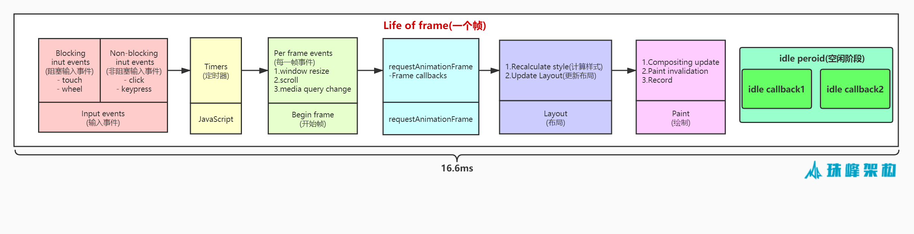

### 模拟时间切片

requestIdleCallback,React 中没有使用`requestIdleCallback`，因为该方法有浏览器兼容性问题，而且时间不可控

```javaScript
      // 模拟程序的用时
       function sleep(d) {
        for (var t = Date.now(); Date.now() - t <= d; );
      }
      const works = [
        () => {
          console.log("第1个任务开始");
          sleep(20); //sleep(20);
          console.log("第1个任务结束");
        },
        () => {
          console.log("第2个任务开始");
          sleep(20); //sleep(20);
          console.log("第2个任务结束");
        },
        () => {
          console.log("第3个任务开始");
          sleep(20); //sleep(20);
          console.log("第3个任务结束");
        },
      ];

      requestIdleCallback(workLoop);

      function workLoop(deadline) {
        // 因为一帧是16.6ms，浏览器执行完高优先级之后，如果还有时间，会执行workLoop，timeRemaining获取此帧剩余的时间
        console.log("本帧剩余时间", parseInt(deadline.timeRemaining()));
        // 合作式调度
        while (deadline.timeRemaining() > 1 && works.length > 0) {
          performUnitOfWork();
        }
        // 如果还有剩余任务
        if (works.length > 0) {
          console.log(`只剩下${parseInt(deadline.timeRemaining())}ms,时间片到了等待下次空闲时间的调度`);
          requestIdleCallback(workLoop);
        }
      }

      function performUnitOfWork() {
        works.shift()();
      }
```

### Fiber

我们可以通过某些调度策略合理分配 CPU 资源，从而提高用户的响应速度

通过 Fiber 架构，让自己的调和过程变成可被中断。 适时地让出 CPU 执行权，除了可以让浏览器及时地响应用户的交互

Fiber 是一个执行单元,每次执行完一个执行单元, React 就会检查现在还剩多少时间，如果没有时间就将控制权让出去

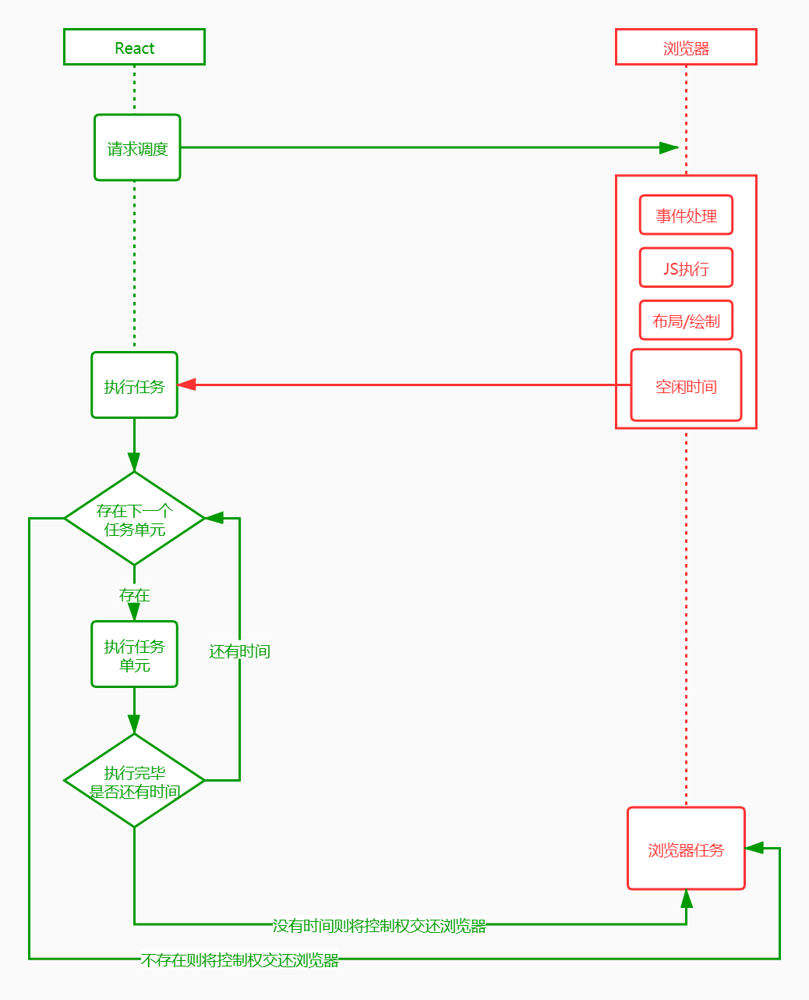

### Fiber 是一种数据结构

React 目前的做法是使用链表, 每个虚拟节点内部表示为一个 Fiber

从顶点开始遍历

如果有第一个儿子，先遍历第一个儿子

如果没有第一个儿子，标志着此节点遍历完成

如果有弟弟遍历弟弟

如果有没有下一个弟弟，返回父节点标识完成父节点遍历，如果有叔叔遍历叔叔

没有父节点遍历结束

### Fiber 树

```javaScript
   /**
 *
 * @param {*} tag fiber的类型 函数组件0  类组件1 原生组件5 根元素3
 * @param {*} pendingProps 新属性，等待处理或者说生效的属性
 * @param {*} key 唯一标识
 */
export function FiberNode(tag, pendingProps, key) {
  this.tag = tag;
  this.key = key;
  this.type = null; //fiber类型，来自于 虚拟DOM节点的type  span div p
  //每个虚拟DOM=>Fiber节点=>真实DOM
  this.stateNode = null; //此fiber对应的真实DOM节点  h1=>真实的h1DOM

  this.return = null; //指向父节点
  this.child = null; //指向第一个子节点
  this.sibling = null; //指向弟弟

  //fiber哪来的？通过虚拟DOM节点创建，虚拟DOM会提供pendingProps用来创建fiber节点的属性
  this.pendingProps = pendingProps; //等待生效的属性
  this.memoizedProps = null; //已经生效的属性

  //每个fiber还会有自己的状态，每一种fiber 状态存的类型是不一样的
  //类组件对应的fiber 存的就是类的实例的状态,HostRoot存的就是要渲染的元素
  this.memoizedState = null;
  //每个fiber身上可能还有更新队列
  this.updateQueue = null;
  //副作用的标识，表示要针对此fiber节点进行何种操作
  this.flags = NoFlags; //自己的副作用
  //子节点对应的副使用标识
  this.subtreeFlags = NoFlags;
  //替身，轮替 在后面讲DOM-DIFF的时候会用到
  this.alternate = null;
  this.index = 0;
  this.deletions = null;
  this.lanes = NoLanes;
  this.childLanes = NoLanes;
  this.ref = null;
}
```

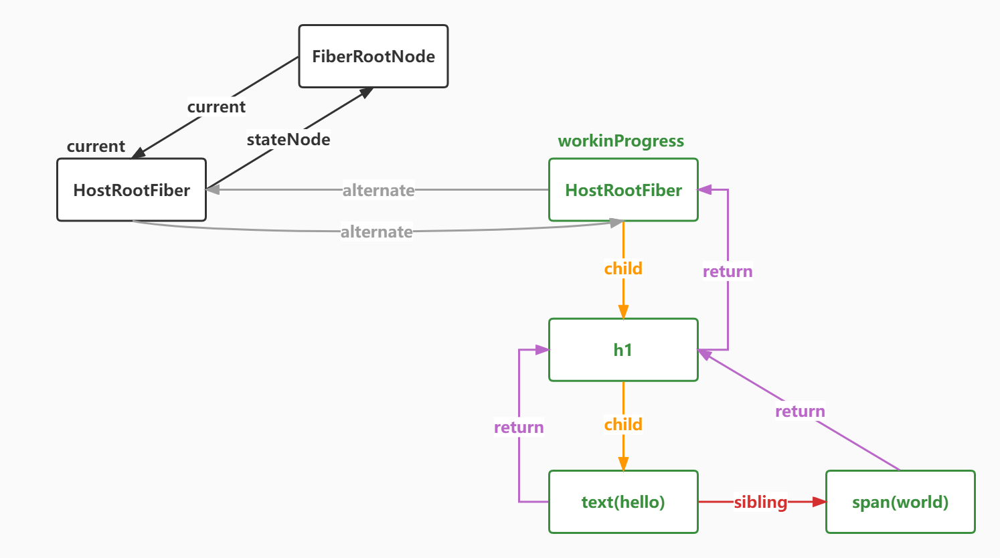

### 递归创建 Fiber 树

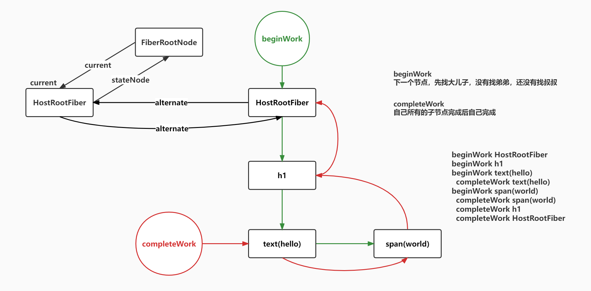

### Fiber 双缓存树

1.react 根据双缓冲机制维护了两个 fiber 树，因为更新时依赖于老状态的

`current Fiber树`：用于渲染页面

`workinProgress Fiber树`：用于在内存构建中，方便在构建完成后直接替换 current Fiber 树

2.Fiber 双缓存

`首次渲染时`：
render 阶段会根据 jsx 对象生成新的 Fiber 节点，然后这些 Fiber 节点会被标记成带有‘Placement’的副作用，说明他们是新增节点，需要被插入到真实节点中，在 commitWork 阶段就会操作成真实节点，将它们插入到 dom 树中。

`页面触发更新时`:
render 阶段会根据最新的 jsx 生成的虚拟 dom 和 current Fiber 树进行对比，比较之后生成 workinProgress Fiber(workinProgress Fiber 树的 alternate 指向 Current Fiber 树的对应节点，这些 Fiber 会带有各种副作用，比如‘Deletion’、‘Update’、'Placement’等)这一对比过程就是 diff 算法

当 workinProgress Fiber 树构建完成，workInprogress 则成为了 curent Fiber 渲染到页面上

diff ⽐较的是什么？ ⽐较的是 current fiber 和 vdom，⽐较之后⽣成 workInprogress Fiber

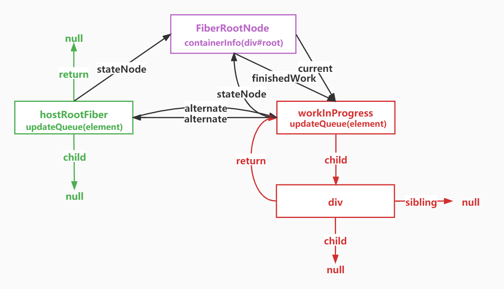

## 事件代理

### 合成事件代理

合成事件是围绕浏览器原生事件充当跨浏览器包装器的对象,它们将不同浏览器的行为合并为一个 API,这样做是为了确保事件在不同浏览器中显示一致的属性，将事件代理在**root 根节点**。

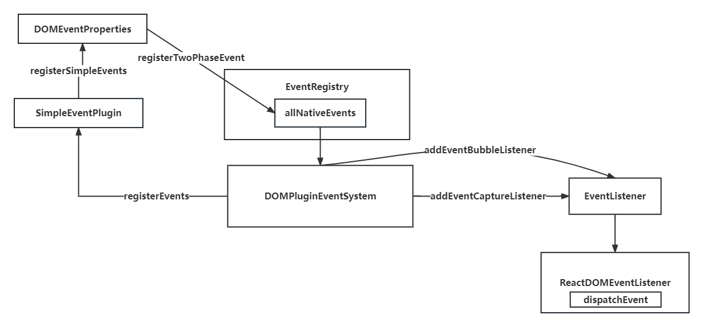

`DOMPluginEventSystem`文件中，首先调用`registerEvents`函数，进行注册所有的事件

```javaScript
// 用于注册
const simpleEventPluginEvents = [
  'abort',
  'auxClick',
  'cancel',
  'canPlay',
  'canPlayThrough',
  ...
];
// 注册所有的简单事件
export function registerSimpleEvents() {
  for (let i = 0; i < simpleEventPluginEvents.length; i++) {
    const eventName = simpleEventPluginEvents[i]; //click
    const domEventName = eventName.toLowerCase(); //click
    const capitalizeEvent = eventName[0].toUpperCase() + eventName.slice(1); // Click
    registerSimpleEvent(domEventName, `on${capitalizeEvent}`); //click,onClick
  }
}
```

通过`topLevelEventsToReactNames`map 方法，进行事件的映射，类似于`click`=>`onClick`

```javaScript
export const topLevelEventsToReactNames = new Map();
function registerSimpleEvent(domEventName, reactName) {
  //把原生事件名和处理函数的名字进行映射或者说绑定，click=>onClick
  topLevelEventsToReactNames.set(domEventName, reactName);
  registerTwoPhaseEvent(reactName, [domEventName]); //'onClick' ['click']
}
```

`registerTwoPhaseEvent`注册两个阶段的事件，冒泡与捕获,通过`registerDirectEvent`方法可以吧所有的事件，添加到`allNativeEvents`set 数据结构中

```javaScript
/**
 * 注册两个阶段的事件
 * 当我在页面中触发click事件的时候，会走事件处理函数
 * 事件处理函数需要找到DOM元素对应的要执行React事件 onClick onClickCapture
 * @param {*} registrationName React事件名 onClick
 * @param {*} dependencies 原生事件数组 [click]
 */
export function registerTwoPhaseEvent(registrationName, dependencies) {
  //注册冒泡事件的对应关系
  registerDirectEvent(registrationName, dependencies);
  //注意捕获事件的对应的关系
  registerDirectEvent(registrationName + 'Capture', dependencies);
}
export function registerDirectEvent(registrationName, dependencies) {
  for (let i = 0; i < dependencies.length; i++) {
    allNativeEvents.add(dependencies[i]);//click
  }
}
```

至此，把所有的方法添加到`allNativeEvents`中,在`listenToAllSupportedEvents`函数可以直接遍历`allNativeEvents`结构，进行注册原生事件,`allNativeEvents`其实就是类似于['click','touch'l...]的结构

```javaScript
export function listenToAllSupportedEvents(rootContainerElement) {
  //监听根容器，也就是div#root只监听一次
  if (!rootContainerElement[listeningMarker]) {
    rootContainerElement[listeningMarker] = true;
    // 遍历所有的原生的事件比如click,进行监听
    allNativeEvents.forEach((domEventName) => {
      listenToNativeEvent(domEventName, true, rootContainerElement);
      listenToNativeEvent(domEventName, false, rootContainerElement);
    });
  }
}
```

`listenToNativeEvent`进行注册原生事件

```javaScript
/**
 * 注册原生事件
 * @param {*} domEventName 原生事件 click
 * @param {*} isCapturePhaseListener 是否是捕获阶段 true false
 * @param {*} target 目标DOM节点 div#root 容器节点
 */
export function listenToNativeEvent(domEventName, isCapturePhaseListener, target) {
  let eventSystemFlags = 0;//默认是0指的是冒泡  4是捕获
  if (isCapturePhaseListener) {
    eventSystemFlags |= IS_CAPTURE_PHASE;
  }
  addTrappedEventListener(target, domEventName, eventSystemFlags, isCapturePhaseListener);
}

function addTrappedEventListener(
  targetContainer, domEventName, eventSystemFlags, isCapturePhaseListener
) {
  // 监听事件
  const listener = createEventListenerWrapperWithPriority(targetContainer, domEventName, eventSystemFlags);
  if (isCapturePhaseListener) {
    addEventCaptureListener(targetContainer, domEventName, listener);
  } else {
    addEventBubbleListener(targetContainer, domEventName, listener);
  }
}

// 添加捕获事件
export function addEventCaptureListener(target, eventType, listener) {
  target.addEventListener(eventType, listener, true);
  return listener;
}
// 添加冒泡事件
export function addEventBubbleListener(target, eventType, listener) {
  target.addEventListener(eventType, listener, false);
  return listener;
}
```

创建事件监听，核心事件是`dispatchDiscreteEvent`

```javaScript
export function createEventListenerWrapperWithPriority(
  targetContainer,
  domEventName,
  eventSystemFlags
) {
  const listenerWrapper = dispatchDiscreteEvent;
  return listenerWrapper.bind(null, domEventName, eventSystemFlags, targetContainer);
}

/**
 * 派发离散的事件的的监听函数
 * @param {*} domEventName 事件名 click
 * @param {*} eventSystemFlags 阶段 0 冒泡 4 捕获
 * @param {*} container 容器div#root
 * @param {*} nativeEvent 原生的事件
 */
function dispatchDiscreteEvent(domEventName, eventSystemFlags, container, nativeEvent) {
  //在你是点击按钮的时候，需要设置更新优先级
  //先获取当前老的更新优先级
  const previousPriority = getCurrentUpdatePriority();
  try {
    //把当前的更新优先级设置为离散事件优先级 1
    setCurrentUpdatePriority(DiscreteEventPriority);
    //派发事件
    dispatchEvent(domEventName, eventSystemFlags, container, nativeEvent);
  } finally {
    setCurrentUpdatePriority(previousPriority);
  }
}
```

### 合成事件派发

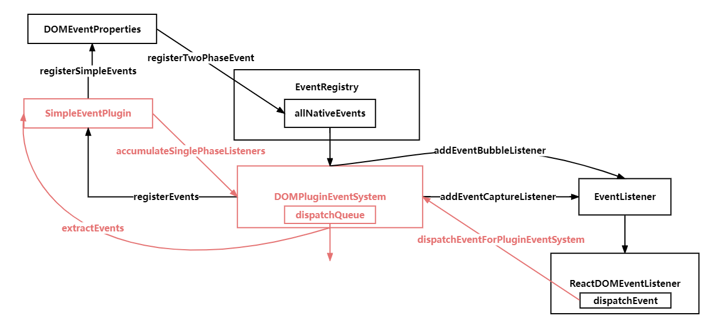

`dispatchEvent`执行派发事件，这里其实通过调用`createInstance`方法时，调用`precacheFiberNode`方法，预先缓存 fiber 节点到 DOM 元素上，可以进行一一对应。

1. 收集沿途的绑定事件（onClick或者onClickCapture冒泡或捕获）

2. 基于原始事件参数event构造合成事件参数

3. 遍历捕获capture，依次执行

4. 遍历冒泡bubble，依次执行


```javaScript
/**
 * 此方法就是委托给容器的回调，当容器#root在捕获或者说冒泡阶段处理事件的时候会执行此函数
 * @param {*} domEventName
 * @param {*} eventSystemFlags
 * @param {*} container
 * @param {*} nativeEvent
 */
export function dispatchEvent(domEventName, eventSystemFlags, targetContainer, nativeEvent) {
  // 获取事件源，它是一个真实DOM，通过nativeEvent.target获取原生事件对象
  const nativeEventTarget = getEventTarget(nativeEvent);
  // 从真实的DOM节点上获取它对应的fiber节点，targetNode[internalInstanceKey]
  const targetInst = getClosestInstanceFromNode(nativeEventTarget);
  dispatchEventForPluginEventSystem(
    domEventName,//click
    eventSystemFlags,//0 4
    nativeEvent,//原生事件
    targetInst,//此真实DOM对应的fiber
    targetContainer//目标容器
  );
}
```

`dispatchEventForPluginEventSystem`，这里开始派发事件，从 targetFiber，从下往上遍历 Fiber 树，收集事件进行派发,`accumulateSinglePhaseListeners`方法里，通过 listeners 收集监听的事件

```javaScript

export function accumulateSinglePhaseListeners(
  targetFiber,
  reactName,
  nativeEventType,
  isCapturePhase
) {
  const captureName = reactName + "Capture";
  const reactEventName = isCapturePhase ? captureName : reactName;
  const listeners = [];
  let instance = targetFiber;
  while (instance !== null) {
    const { stateNode, tag } = instance; //stateNode 当前的执行回调的DOM节点
    if (tag === HostComponent && stateNode !== null) {
      const listener = getListener(instance, reactEventName);
      if (listener) {
        listeners.push(createDispatchListener(instance, listener, stateNode));
      }
    }
    instance = instance.return;
  }
  return listeners;
}
function createDispatchListener(instance, listener, currentTarget) {
  return { instance, listener, currentTarget };
}

```

调用`extractEvents`方法，这里通过不同的事件类型，构建不同的`SyntheticEventCtor`合成对象，将原生事件上拷贝到合成事件实例上，同时重写浏览器兼容

```javaScript
/**
 * 把要执行回调函数添加到dispatchQueue中
 * @param {*} dispatchQueue 派发队列，里面放置我们的监听函数
 * @param {*} domEventName DOM事件名 click
 * @param {*} targetInst 目标fiber
 * @param {*} nativeEvent 原生事件
 * @param {*} nativeEventTarget 原生事件源
 * @param {*} eventSystemFlags  事件系统标题 0 表示冒泡 4表示捕获
 * @param {*} targetContainer  目标容器 div#root
 */
function extractEvents(
  dispatchQueue,
  domEventName,
  targetInst,
  nativeEvent,
  nativeEventTarget,//click => onClick
  eventSystemFlags,
  targetContainer) {
  const reactName = topLevelEventsToReactNames.get(domEventName);//click=>onClick
  let SyntheticEventCtor;//合成事件的构建函数
  switch (domEventName) {
    case 'click':
      // 鼠标合成时间
      SyntheticEventCtor = SyntheticMouseEvent;
      break;
    default:
      break;
  }
  const isCapturePhase = (eventSystemFlags & IS_CAPTURE_PHASE) !== 0;//是否是捕获阶段
  const listeners = accumulateSinglePhaseListeners(
    targetInst,
    reactName,
    nativeEvent.type,
    isCapturePhase
  );
  //如果有要执行的监听函数的话[onClickCapture,onClickCapture]=[ChildCapture,ParentCapture]
  if (listeners.length > 0) {
    const event = new SyntheticEventCtor(
      reactName, domEventName, null, nativeEvent, nativeEventTarget);
    dispatchQueue.push({
      event,//合成事件实例
      listeners//监听函数数组
    });
  }
}
```

### 合成事件提取

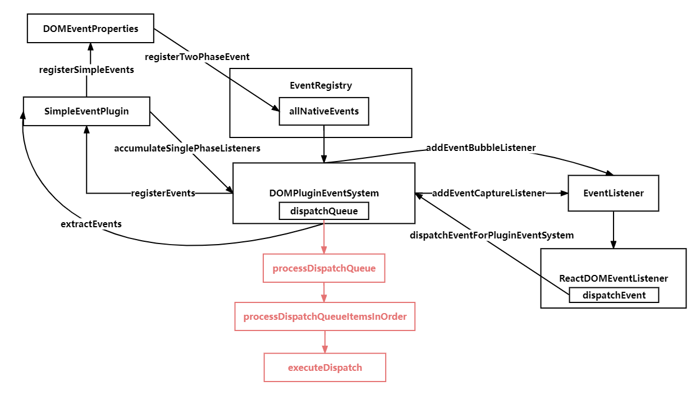

```javaScript
function processDispatchQueue(dispatchQueue, eventSystemFlags) {
  //判断是否在捕获阶段
  const inCapturePhase = (eventSystemFlags & IS_CAPTURE_PHASE) !== 0;
  for (let i = 0; i < dispatchQueue.length; i++) {
    const { event, listeners } = dispatchQueue[i];
    processDispatchQueueItemsInOrder(event, listeners, inCapturePhase);
  }
}
```
`processDispatchQueueItemsInOrder`执行，遍历`dispatchListeners`,进行循环执行事件回调

```javaScript
function processDispatchQueueItemsInOrder(
  event,
  dispatchListeners,
  inCapturePhase
) {
  if (inCapturePhase) {
    //dispatchListeners[子，父]
    for (let i = dispatchListeners.length - 1; i >= 0; i--) {
      const { listener, currentTarget } = dispatchListeners[i];
      if (event.isPropagationStopped()) {
        return;
      }
      executeDispatch(event, listener, currentTarget);
    }
  } else {
    for (let i = 0; i < dispatchListeners.length; i++) {
      const { listener, currentTarget } = dispatchListeners[i];
      if (event.isPropagationStopped()) {
        return;
      }
      executeDispatch(event, listener, currentTarget);
    }
  }
}
```

调用`executeDispatch`执行真正的合成事件触发，合成事件实例的 currentTarget 是不断变化的，event.nativeEventTarget，它是原始的事件源(#root)，永远不变，event.currentTarget 是当前的事件源，它是会随着事件回调的执行不断变化的

```javaScript
function executeDispatch(event, listener, currentTarget) {
  event.currentTarget = currentTarget;
  listener(event);
}
```

## reconciler

<!--
 * @Author: changcheng
 * @LastEditTime: 2023-10-04 16:08:47
-->
### createRoot


确定渲染的根节点，同时调用`createFiberRoot`，创建 Fiber 的根节点，FiberRootNode = containerInfo,它的本质就是一个真实的 DOM 节点，div#root，其实就是一个真实的 DOM 节点

+ 返回根`FiberRootNode`

+ 返回`render`函数进行渲染

```javaScript
// div#root
function ReactDOMRoot(internalRoot) {
  this._internalRoot = internalRoot;
}
// 创建根节点
export function createRoot(container) {// div#root
  // 创建Fiber的根节点
  const root = createContainer(container);
  // 增加事件监听
  listenToAllSupportedEvents(container);
  return new ReactDOMRoot(root);
}
// render方法，调用updateContainer把虚拟dom element变成真实DOM插入到container容器中
ReactDOMRoot.prototype.render = function (children) {
  const root = this._internalRoot;
  root.containerInfo.innerHTML = '';
  updateContainer(children, root);
}
export function createContainer(containerInfo) {
   // 创建Fiber的根节点
  return createFiberRoot(containerInfo);
}
// 创建根Fiber
export function createFiberRoot(containerInfo) {
  const root = new FiberRootNode(containerInfo);
  //HostRoot指的就是根节点div#root
  const uninitializedFiber = createHostRootFiber();
  //根容器的current指向当前的根fiber
  root.current = uninitializedFiber;
  //根fiber的stateNode,也就是真实DOM节点指向FiberRootNode
  uninitializedFiber.stateNode = root;
  // 初始化更新队列
  initialUpdateQueue(uninitializedFiber);
  return root;
}
function FiberRootNode(containerInfo) {
  this.containerInfo = containerInfo;//div#root
  //表示此根上有哪些赛道等待被处理
  this.pendingLanes = NoLanes;
  this.callbackNode = null;
  this.callbackPriority = NoLane;
  //过期时间 存放每个赛道过期时间
  this.expirationTimes = createLaneMap(NoTimestamp);
  //过期的赛道
  this.expiredLanes = NoLanes;
}

```
### initialUpdateQueue 

函数进行初始更新队列

Fiber 的`updateQueue`链表会在`processUpdateQueue`函数中根据老状态和更新队列中的更新计算最新的状态。

```javaScript

export function createFiberRoot(containerInfo) {
  const root = new FiberRootNode(containerInfo);
  //HostRoot指的就是根节点div#root
  const uninitializedFiber = createHostRootFiber();
  //根容器的current指向当前的根fiber
  root.current = uninitializedFiber;
  //根fiber的stateNode,也就是真实DOM节点指向FiberRootNode
  uninitializedFiber.stateNode = root;
  initialUpdateQueue(uninitializedFiber);
  return root;
}

export function initialUpdateQueue(fiber) {
  //创建一个新的更新队列
  //pending其实是一个循环链接
  const queue = {
    baseState: fiber.memoizedState,//本次更新前当前的fiber的状态,更新会其于它进行计算状态
    firstBaseUpdate: null,//本次更新前该fiber上保存的上次跳过的更新链表头
    lastBaseUpdate: null,//本次更新前该fiber上保存的上次跳过的更新链尾部
    shared: {
      pending: null,
    },
  };
  fiber.updateQueue = queue;
}
```

### updateContainer 

更新容器，把虚拟 `dom element` 变成真实 DOM 插入到 container 容器中

+ 创建一个更新事件

+ 把更新事件推进队列

+ 调度更新

```javaScript
/**
 * 更新容器，把虚拟dom element变成真实DOM插入到container容器中
 * @param {*} element 虚拟DOM
 * @param {*} container DOM容器 FiberRootNode containerInfo div#root
 */
export function updateContainer(element, container) {
  //获取当前的根fiber
  const current = container.current;
  const eventTime = requestEventTime();
  //请求一个更新车道
  const lane = requestUpdateLane(current);
  //创建更新
  const update = createUpdate(lane);
  //要更新的虚拟DOM
  update.payload = { element }; //h1
  //把此更新对象添加到current这个根Fiber的更新队列上,返回根节点
  const root = enqueueUpdate(current, update, lane);
  // 进行调度
  scheduleUpdateOnFiber(root, current, lane, eventTime);
}

```


### wookLoop

React 渲染可以概括为：两大阶段，五小阶段

**render 阶段**

- beginWork:根据当前的`FiberRoot Node`构建`子Fiber Node`，以及在`update`时，标记`Placement`和`ChildDeletion`

- completeWork:完成一个 Fiber 节点，构建DOM，查找兄弟节点以及向上递归

**commit 阶段**

- commitRoot:提交渲染完的根节点。

- commitMutationEffectsOnFiber:通过`recursivelyTraverseMutationEffects`遍历子节点，处理子节点上的副作用。

- commitReconciliationEffects:往真实 DOM 树中插入 DOM 节点。

### beginWork

`beginWork` 函数自身就是一个简单的基于 `fiber.tag` 的 switch 语句，这个阶段的逻辑主要在各个分支函数中。`beginWork` 最主要的工作：

协调。根据 beginWork 函数中 传入的 `current` 和 `workinProgress` 构建新的 Fiber 链表，即 DOM DIFF。

标记副作用。在协调子元素的过程中，会根据子元素是否增删改，从而将新的 newFiber 子节点的 flags 更新为对应的值。

返回新的子 fiber 节点作为下一个工作的 fiber 节点

模拟 React 中 `processUpdateQueue`函数，根据老状态和更新队列中的更新计算最新的状态，与 hook 中的更新队列一样，都是循环链表

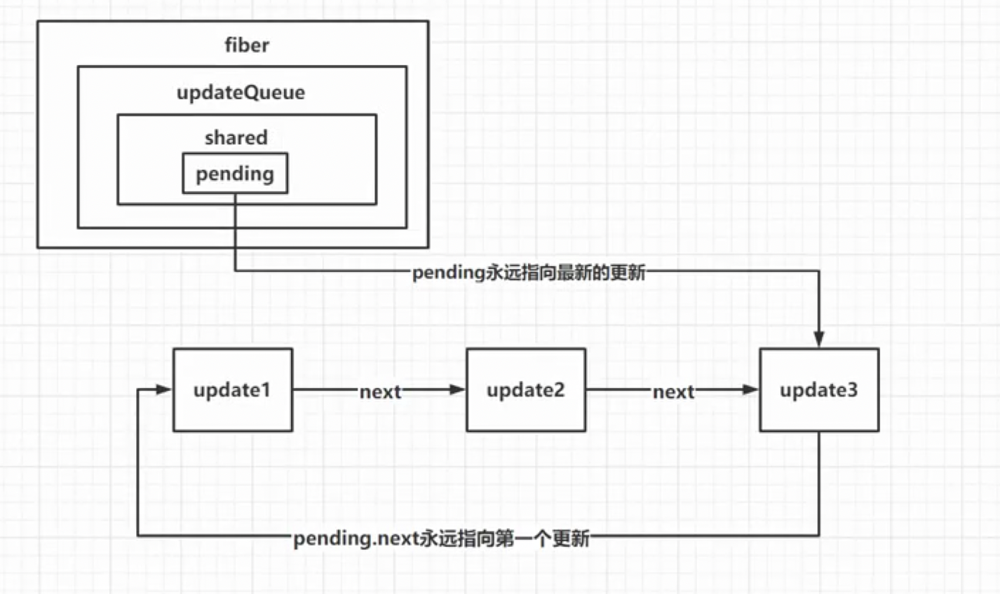

```javaScript
/**
 * 建立排队更新
 */
function enqueueUpdate(fiber, update) {
  const updateQueue = fiber.updateQueue;
  const shared = updateQueue.shared;
  const pending = shared.pending;
  // 如果是空的，next指向自己
  if (pending === null) {
    update.next = update;
  } else {
    //如果更新队列不为空的话，取出第一个更新
    update.next = pending.next;
    //然后让原来队列的最后一个的next指向新的next，
    pending.next = update;
  }
  // pending永远指向最后一个更新,最后一个更新next指向第一个更新
  updateQueue.shared.pending = update;
}
/**
 * 更新最终的队列
 */
function processUpdateQueue(fiber) {
  const queue = fiber.updateQueue;
  const pending = queue.shared.pending;
  if (pending !== null) {
    queue.shared.pending = null;
    //最后一个更新
    const lastPendingUpdate = pending;
    const firstPendingUpdate = lastPendingUpdate.next;
    //把环状链接剪开,这里就成了单向链表
    lastPendingUpdate.next = null;
    let newState = fiber.memoizedState;
    let update = firstPendingUpdate;
    // 如果有next就继续循环
    while (update) {
      newState = getStateFromUpdate(update, newState);
      // 指向下一个链表节点
      update = update.next;
    }
    fiber.memoizedState = newState;
  }
}
/**
 * 模拟queue根据老状态计算新状态
 */
function getStateFromUpdate(update, prevState) {
  return Object.assign({}, update.payload, prevState);
}
let fiber = { memoizedState: { sex: "男" } };
initialUpdateQueue(fiber);

let update1 = createUpdate();
update1.payload = { age: 18 };
enqueueUpdate(fiber, update1);

let update2 = createUpdate();
update2.payload = { name: "cc" };
enqueueUpdate(fiber, update2);

// fiber的udpateQueue也就是环形链表
// const fiberRsult = {
//   memoizedState: { sex: "男" },
//   updateQueue: {
//     shared: {
//       pending: {
//         payload: { age: 18 },
//         next: {
//           payload: { name: "cc" },
//           next: [Circular * 1],
//         },
//       },
//     },
//   },
// };

//基于老状态，计算新状态
processUpdateQueue(fiber);
console.log(fiber.memoizedState); // { name: 'cc', age: 18, sex: '男' }

```

### scheduleUpdateOnFiber

 计划更新 Root,同步或者异步

```javaScript
/**
 * 计划更新root
 * 源码中此处有一个任务的功能
 * @param {*} root
 */
export function scheduleUpdateOnFiber(root, fiber, lane, eventTime) {
  markRootUpdated(root, lane);
  //确保调度执行root上的更新
  ensureRootIsScheduled(root, eventTime);
}
function ensureRootIsScheduled(root, currentTime) {
  //先获取当前根上执行任务
  const existingCallbackNode = root.callbackNode;
  //把所有饿死的赛道标记为过期
  markStarvedLanesAsExpired(root, currentTime);
  //获取当前优先级最高的车道
  const nextLanes = getNextLanes(root, workInProgressRootRenderLanes); //16
  //如果没有要执行的任务
  if (nextLanes === NoLanes) {
    return;
  }
  //获取新的调度优先级
  let newCallbackPriority = getHighestPriorityLane(nextLanes); //16
  //获取现在根上正在运行的优先级
  const existingCallbackPriority = root.callbackPriority;
  //如果新的优先级和老的优先级一样，则可以进行批量更新
  if (existingCallbackPriority === newCallbackPriority) {
    return;
  }
  if (existingCallbackNode !== null) {
    console.log("cancelCallback");
    Scheduler_cancelCallback(existingCallbackNode);
  }
  //新的回调任务
  let newCallbackNode = null;
  //如果新的优先级是同步的话
  if (newCallbackPriority === SyncLane) {
    //先把performSyncWorkOnRoot添回到同步队列中
    scheduleSyncCallback(performSyncWorkOnRoot.bind(null, root));
    //再把flushSyncCallbacks放入微任务
    queueMicrotask(flushSyncCallbacks);
    //如果是同步执行的话
    newCallbackNode = null;
  } else {
    //如果不是同步，就需要调度一个新的任务
    let schedulerPriorityLevel;
    switch (lanesToEventPriority(nextLanes)) {
      case DiscreteEventPriority:
        schedulerPriorityLevel = ImmediateSchedulerPriority;
        break;
      case ContinuousEventPriority:
        schedulerPriorityLevel = UserBlockingSchedulerPriority;
        break;
      case DefaultEventPriority:
        schedulerPriorityLevel = NormalSchedulerPriority;
        break;
      case IdleEventPriority:
        schedulerPriorityLevel = IdleSchedulerPriority;
        break;
      default:
        schedulerPriorityLevel = NormalSchedulerPriority;
        break;
    }
    newCallbackNode = Scheduler_scheduleCallback(
      schedulerPriorityLevel,
      performConcurrentWorkOnRoot.bind(null, root)
    );
  }
  //在根节点的执行的任务是newCallbackNode
  root.callbackNode = newCallbackNode;
  root.callbackPriority = newCallbackPriority;
   if (workInProgressRoot) return;
   workInProgressRoot = root;
   //告诉 浏览器要执行performConcurrentWorkOnRoot 在此触发更新
   Scheduler_scheduleCallback(NormalSchedulerPriority, performConcurrentWorkOnRoot.bind(null, root));
}

```

### performSyncWorkOnRoot

`prepareFreshStack`函数非常重要，这里构建了`workInProgress`树

```javaScript
/**
 * 在根上执行同步工作
 */
function performSyncWorkOnRoot(root) {
  //获得最高优的lane
  const lanes = getNextLanes(root);
  //渲染新的fiber树
  renderRootSync(root, lanes);
  //获取新渲染完成的fiber根节点
  const finishedWork = root.current.alternate;
  root.finishedWork = finishedWork;
  // 提交最终的Root
  commitRoot(root);
  return null;
}
function renderRootSync(root, renderLanes) {
  //如果新的根和老的根不一样，或者新的渲染优先级和老的渲染优先级不一样
  if (
    root !== workInProgressRoot ||
    workInProgressRootRenderLanes !== renderLanes
  ) {
    // 创建Fiber树的替身
    prepareFreshStack(root, renderLanes);
  }
  // 执行工作单元
  workLoopSync();
  return RootCompleted;
}
// 构建双Fiber树
function prepareFreshStack(root, renderLanes) {
  workInProgress = createWorkInProgress(root.current, null);
  workInProgressRootRenderLanes = renderLanes;
  workInProgressRoot = root;
  finishQueueingConcurrentUpdates();
}
/**
 * 基于老的fiber和新的属性创建新的fiber
 * 1.current和workInProgress不是一个对象
 * 2.workInProgress
 *   2.1有两种情况，一种是没有，创建一个新，互相通过alternate指向
 *   2.2 存在alternate,直接复用老的alternate就可以了
 * 复用有两层含义
 * 1.复用老的fiber对象
 * 2.复用老的真实DOM
 * @param {*} current 老fiber
 * @param {*} pendingProps 新属性
 */
export function createWorkInProgress(current, pendingProps) {
  let workInProgress = current.alternate;
  // 如果alternate为null说明是第一次渲染，直接创建新的
  if (workInProgress === null) {
    workInProgress = createFiber(current.tag, pendingProps, current.key);
    workInProgress.type = current.type;
    workInProgress.stateNode = current.stateNode;
    workInProgress.alternate = current;
    current.alternate = workInProgress;
  } else {
  // alternate存在，直接复用老的Fiber上的属性
    workInProgress.pendingProps = pendingProps;
    workInProgress.type = current.type;
    workInProgress.flags = NoFlags;
    workInProgress.subtreeFlags = NoFlags;
    workInProgress.deletions = null;
  }
  workInProgress.child = current.child;
  workInProgress.memoizedProps = current.memoizedProps;
  workInProgress.memoizedState = current.memoizedState;
  workInProgress.updateQueue = current.updateQueue;
  workInProgress.sibling = current.sibling;
  workInProgress.index = current.index;
  workInProgress.ref = current.ref;
  workInProgress.flags = current.flags;
  workInProgress.lanes = current.lanes;
  workInProgress.childLanes = current.childLanes;
  return workInProgress;
}
```
### completeWork

当一个 fiber 节点没有子节点，或者子节点仅仅是单一的字符串或者数字时，说明这个 fiber 节点当前的 `beginWork` 已经完成，可以进入`completeUnitOfWork` 完成工作。

`completeUnitOfWork` 主要工作如下：

- 调用 `completeWork` 创建真实的 DOM 节点，属性赋值等

- 通过调用 `bubbleProperties` 合并 `subtreeFlags`与 `flags`合并副作用

- 如果有兄弟节点，则返回兄弟节点，兄弟节点执行 beginWork。否则继续完成父节点的工作

```javaScript
/**
 * 完成一个fiber节点
 * @param {*} current 老fiber
 * @param {*} workInProgress 新的构建的fiber
 */
export function completeWork(current, workInProgress) {
  const newProps = workInProgress.pendingProps;
  switch (workInProgress.tag) {
    case HostRoot:
      bubbleProperties(workInProgress);
      break;
    //如果完成的是原生节点的话
    case HostComponent:
      ///现在只是在处理创建或者说挂载新节点的逻辑，后面此处分进行区分是初次挂载还是更新
      //创建真实的DOM节点
      const { type } = workInProgress;
      //如果老fiber存在，并且老fiber上真实DOM节点，要走节点更新的逻辑
      if (current !== null && workInProgress.stateNode !== null) {
        updateHostComponent(current, workInProgress, type, newProps);
        if (current.ref !== workInProgress.ref !== null) {
          markRef(workInProgress);
        }
      } else {
        const instance = createInstance(type, newProps, workInProgress);
        //把自己所有的儿子都添加到自己的身上
        appendAllChildren(instance, workInProgress);
        workInProgress.stateNode = instance;
        finalizeInitialChildren(instance, type, newProps);
        if (workInProgress.ref !== null) {
          markRef(workInProgress);
        }
      }
      bubbleProperties(workInProgress);
      break;
    case FunctionComponent:
      bubbleProperties(workInProgress);
      break;
    case HostText:
      //如果完成的fiber是文本节点，那就创建真实的文本节点
      const newText = newProps;
      //创建真实的DOM节点并传入stateNode
      workInProgress.stateNode = createTextInstance(newText);
      //向上冒泡属性
      bubbleProperties(workInProgress);
      break;
  }
}
```
调用`updateHostComponent`，拿到current的老属性和新的newProps，收集属性差异

```javaScript
/**
 * 在fiber(button)的完成阶段准备更新DOM
 * @param {*} current button老fiber
 * @param {*} workInProgress button的新fiber
 * @param {*} type 类型
 * @param {*} newProps 新属性
 */
function updateHostComponent(current, workInProgress, type, newProps) {
  const oldProps = current.memoizedProps;//老的属性
  const instance = workInProgress.stateNode;//老的DOM节点
  //比较新老属性，收集属性的差异
  const updatePayload = prepareUpdate(instance, type, oldProps, newProps);
  //让原生组件的新fiber更新队列等于[]
  workInProgress.updateQueue = updatePayload;
  if (updatePayload) {
    markUpdate(workInProgress);
  }
}
```

```javaScript
export function prepareUpdate(domElement, type, oldProps, newProps) {
  return diffProperties(domElement, type, oldProps, newProps);
}
```

调用`diffProperties`，将差异收集到`updatePayload`数组当中，然后将 workInProgress.updateQueue = updatePayload，然后将副作用标记为更新

```javaScript
export function diffProperties(domElement, tag, lastProps, nextProps) {
  let updatePayload = null;
  let propKey;
  let styleName;
  let styleUpdates = null;
  //处理属性的删除 如果说一个属性在老对象里有，新对象没有的话，那就意味着删除
  for (propKey in lastProps) {
    //如果新属性对象里有此属性，或者老的没有此属性，或者老的是个null
    if (nextProps.hasOwnProperty(propKey) || !lastProps.hasOwnProperty(propKey) || lastProps[propKey] === null) {
      continue;
    }
    if (propKey === STYLE) {
      const lastStyle = lastProps[propKey];
      for (styleName in lastStyle) {
        if (lastStyle.hasOwnProperty(styleName)) {
          if (!styleUpdates) {
            styleUpdates = {};
          }
          styleUpdates[styleName] = '';
        }
      }
    } else {
      (updatePayload = updatePayload || []).push(propKey, null);
    }
  }
  //遍历新的属性对象
  for (propKey in nextProps) {
    const nextProp = nextProps[propKey];//新属性中的值
    const lastProp = lastProps !== null ? lastProps[propKey] : undefined;//老属性中的值
    if (!nextProps.hasOwnProperty(propKey) || nextProp === lastProp || (nextProp === null && lastProp === null)) {
      continue;
    }
    if (propKey === STYLE) {
      if (lastProp) {
        //计算要删除的行内样式
        for (styleName in lastProp) {
          //如果此样式对象里在的某个属性老的style里有，新的style里没有
          if (lastProp.hasOwnProperty(styleName) && (!nextProp || !nextProp.hasOwnProperty(styleName))) {
            if (!styleUpdates)
              styleUpdates = {};
            styleUpdates[styleName] = '';
          }
        }
        //遍历新的样式对象
        for (styleName in nextProp) {
          //如果说新的属性有，并且新属性的值和老属性不一样
          if (nextProp.hasOwnProperty(styleName) && lastProp[styleName] !== nextProp[styleName]) {
            if (!styleUpdates)
              styleUpdates = {};
            styleUpdates[styleName] = nextProp[styleName];
          }
        }
      } else {
        styleUpdates = nextProp;
      }
    } else if (propKey === CHILDREN) {
      if (typeof nextProp === 'string' || typeof nextProp === 'number') {
        (updatePayload = updatePayload || []).push(propKey, nextProp);
      }
    } else {
      (updatePayload = updatePayload || []).push(propKey, nextProp);
    }
  }
  if (styleUpdates) {
    (updatePayload = updatePayload || []).push(STYLE, styleUpdates);
  }
  return updatePayload;//[key1,value1,key2,value2]
}
```


当完成一个节点之后，调用`bubbleProperties`，遍历当前 fiber 的所有子节点，把所有的子节的副作用，以及子节点的子节点的副作用全部合并

```javaScript

function bubbleProperties(completedWork) {
  let newChildLanes = NoLanes;
  let subtreeFlags = NoFlags;
  //遍历当前fiber的所有子节点，把所有的子节的副作用，以及子节点的子节点的副作用全部合并
  let child = completedWork.child;
  while (child !== null) {
    newChildLanes = mergeLanes(newChildLanes, mergeLanes(child.lanes, child.childLanes));
    subtreeFlags |= child.subtreeFlags;
    subtreeFlags |= child.flags;
    child = child.sibling;
  }
  completedWork.childLanes = newChildLanes;
  completedWork.subtreeFlags = subtreeFlags;
}


```

## 提交阶段
### commitEffects

React中的commit分为三个阶段

+ beforeMutation阶段

+ mutation阶段

+ layout阶段


`renderRootSync`执行完毕，执行`commitRoot`,调用`commitRootImpl`，运行`commitMutationEffectsOnFiber`，进行副作用变更


### commitMutationEffects

commitMutationEffects执行的主要作用就是找到对应flags的fiberNode, 并执行相应的Dom操作。

1. 我们需要向下遍历找到最底部的`subtreeFlags`不为0的fiberNode的子`fiberNode`节点

2. 由于父节点的`subtreeFlags`存在，不代表`child`对应的`flags`存在，可能是`child`对应的`sibling`节点的`flags`存在

3. 所以在找到对应的`subtreeFlags`的`child`的`fiberNode`后，需要在向上遍历，查找对应的`sibling`节点。

4. 就这样一直往上，最终就会把`div fiberNode`对应的`dom`元素，`append`到`root`中

```javaScript
/**
 * 遍历fiber树，执行fiber上的副作用
 * @param {*} finishedWork fiber节点
 * @param {*} root 根节点
 */
export function commitMutationEffectsOnFiber(finishedWork, root) {
  const current = finishedWork.alternate;
  const flags = finishedWork.flags;
  switch (finishedWork.tag) {
    case FunctionComponent:
      {
        //先遍历它们的子节点，处理它们的子节点上的副作用
        recursivelyTraverseMutationEffects(root, finishedWork);
        //再处理自己身上的副作用
        commitReconciliationEffects(finishedWork);
        if (flags & Update) {
          commitHookEffectListUnmount(HookHasEffect | HookLayout, finishedWork);
        }
        break;
      }
    case HostRoot:
    case HostText: {
      //先遍历它们的子节点，处理它们的子节点上的副作用
      recursivelyTraverseMutationEffects(root, finishedWork);
      //再处理自己身上的副作用
      commitReconciliationEffects(finishedWork);
      break;
    }
    case HostComponent: {
      //先遍历它们的子节点，处理它们的子节点上的副作用
      recursivelyTraverseMutationEffects(root, finishedWork);
      //再处理自己身上的副作用
      commitReconciliationEffects(finishedWork);
      if (flags & Ref) {
        commitAttachRef(finishedWork);
      }
      //处理DOM更新
      if (flags & Update) {
        //获取真实DOM
        const instance = finishedWork.stateNode;
        //更新真实DOM
        if (instance !== null) {
          const newProps = finishedWork.memoizedProps;
          const oldProps = current !== null ? current.memoizedProps : newProps;
          const type = finishedWork.type;
          const updatePayload = finishedWork.updateQueue;
          finishedWork.updateQueue = null;
          if (updatePayload) {
            commitUpdate(instance, updatePayload, type, oldProps, newProps, finishedWork);
          }

        }
      }
      break;
    }
    default:
      break;
  }
}
```

```javaScript
/**
 * 递归遍历处理变更的作用
 * @param {*} root 根节点
 * @param {*} parentFiber 父fiber
 */
function recursivelyTraverseMutationEffects(root, parentFiber) {
  //先把父fiber上该删除的节点都删除
  const deletions = parentFiber.deletions;
  if (deletions !== null) {
    for (let i = 0; i < deletions.length; i++) {
      const childToDelete = deletions[i];
      commitDeletionEffects(root, parentFiber, childToDelete);
    }
  }
  //再去处理剩下的子节点
  if (parentFiber.subtreeFlags & MutationMask) {
    let { child } = parentFiber;
    while (child !== null) {
      commitMutationEffectsOnFiber(child, root);
      child = child.sibling;
    }
  }
}
```

### commitReconciliationEffects

`getHostParentFiber`就是获取到对应父`stateNode`，如果是根节点，对应的是`containerInfo`,对应浏览器环境就是`Dom`

```javaScript
/**
 * 把此fiber的真实DOM插入到父DOM里
 * @param {*} finishedWork 
 */
function commitPlacement(finishedWork) {
  const parentFiber = getHostParentFiber(finishedWork);
  switch (parentFiber.tag) {
    case HostRoot: {
      const parent = parentFiber.stateNode.containerInfo;
      const before = getHostSibling(finishedWork);//获取最近的弟弟真实DOM节点
      insertOrAppendPlacementNode(finishedWork, before, parent);
      break;
    }
    case HostComponent: {
      const parent = parentFiber.stateNode;
      const before = getHostSibling(finishedWork);
      insertOrAppendPlacementNode(finishedWork, before, parent);
      break;
    }
    default:
      break;
  }
}
```
### insertOrAppendPlacementNode

把子节点对应的真实DOM插入到父节点DOM中

```javaScript
/**
 * 把子节点对应的真实DOM插入到父节点DOM中
 * @param {*} node 将要插入的fiber节点
 * @param {*} parent 父真实DOM节点
 */
function insertOrAppendPlacementNode(node, before, parent) {
  const { tag } = node;
  //判断此fiber对应的节点是不是真实DOM节点
  const isHost = tag === HostComponent || tag === HostText;
  //如果是的话直接插入
  if (isHost) {
    const { stateNode } = node;
    if (before) {
      insertBefore(parent, stateNode, before);
    } else {
      appendChild(parent, stateNode);
    }
  } else {
    //如果node不是真实的DOM节点，获取它的大儿子
    const { child } = node;
    if (child !== null) {
      //把大儿子添加到父亲DOM节点里面去
      insertOrAppendPlacementNode(child, before, parent)
      let { sibling } = child;
      while (sibling !== null) {
        insertOrAppendPlacementNode(sibling, before, parent)
        sibling = sibling.sibling;
      }
    }
  }
}
```

## useReducer
### mountReducer

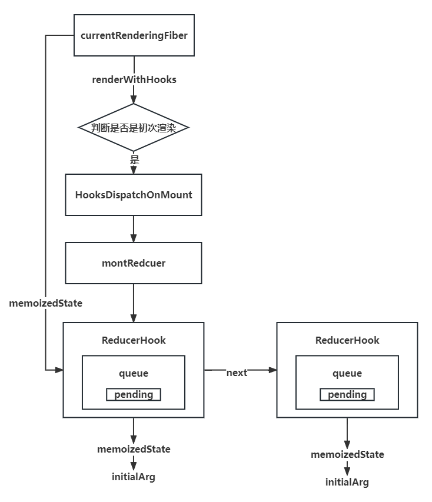

在函数执行之前，也就是`renderWithHooks`函数里，根据`current`和`current.memoizedState`判断是挂载还是更新赋值不同的 dispatch

```javaScript
/**
 * 渲染函数组件
 * @param {*} current 老fiber
 * @param {*} workInProgress 新fiber
 * @param {*} Component 组件定义
 * @param {*} props 组件属性
 * @returns 虚拟DOM或者说React元素
 */
export function renderWithHooks(current, workInProgress, Component, props, nextRenderLanes) {
  //当前正在渲染的车道
  renderLanes = nextRenderLanes
  // 正在渲染的Fiber
  currentlyRenderingFiber = workInProgress;
  //函数组件更新队列里存的effect
  workInProgress.updateQueue = null;
  //函数组件状态存的hooks的链表
  workInProgress.memoizedState = null;
  //如果有老的fiber,并且有老的hook链表，当current类型不同，memoizedState值并不是相同的类型的
  if (current !== null && current.memoizedState !== null) {
    ReactCurrentDispatcher.current = HooksDispatcherOnUpdate;
  } else {
    ReactCurrentDispatcher.current = HooksDispatcherOnMount;
  }
  //需要要函数组件执行前给ReactCurrentDispatcher.current赋值
  const children = Component(props);
  currentlyRenderingFiber = null;
  workInProgressHook = null;
  currentHook = null;
  renderLanes = NoLanes;
  return children;
}
```

`useReduce`初次挂载时，会调用`mountWorkInProgressHook`方法构建挂载中的 Hook，全局的`currentlyRenderingFiber.memoizedState`指向第一个 hook，
`workInProgressHook`保存当前的 hook，`workInProgressHook.next`等于最新的 hook，构建一个单向链表，`currentlyRenderingFiber.memoizedState`，指向第一个，方便从头查找

```javaScript
const HooksDispatcherOnMount = {
  useReducer: mountReducer,
  useState: mountState,
  useEffect: mountEffect,
  useLayoutEffect: mountLayoutEffect,
  useRef: mountRef,
};
function mountReducer(reducer, initialArg) {
  const hook = mountWorkInProgressHook();
  hook.memoizedState = initialArg;
  const queue = {
    pending: null,
    dispatch: null,
    lastRenderedReducer: reducer,
    lastRenderedState: initialArg,
  };
  hook.queue = queue;
  // 构建派发动作，传入当前的fiber和更新队列
  const dispatch = (queue.dispatch = dispatchReducerAction.bind(
    null,
    currentlyRenderingFiber,
    queue
  ));
  return [hook.memoizedState, dispatch];
}

/**
 * 挂载构建中的hook
 * */
function mountWorkInProgressHook() {
  const hook = {
    memoizedState: null, //hook的状态 0
    queue: null, //存放本hook的更新队列 queue.pending=update的循环链表
    next: null, //指向下一个hook,一个函数里可以会有多个hook,它们会组成一个单向链表
    baseState: null, //第一跳过的更新前的状态
    baseQueue: null, //跳过的更新的链表
  };
  if (workInProgressHook === null) {
    //当前函数对应的fiber的状态等于第一个hook对象
    currentlyRenderingFiber.memoizedState = workInProgressHook = hook;
  } else {
    workInProgressHook = workInProgressHook.next = hook;
  }
  return workInProgressHook;
}
```

### updateReducer

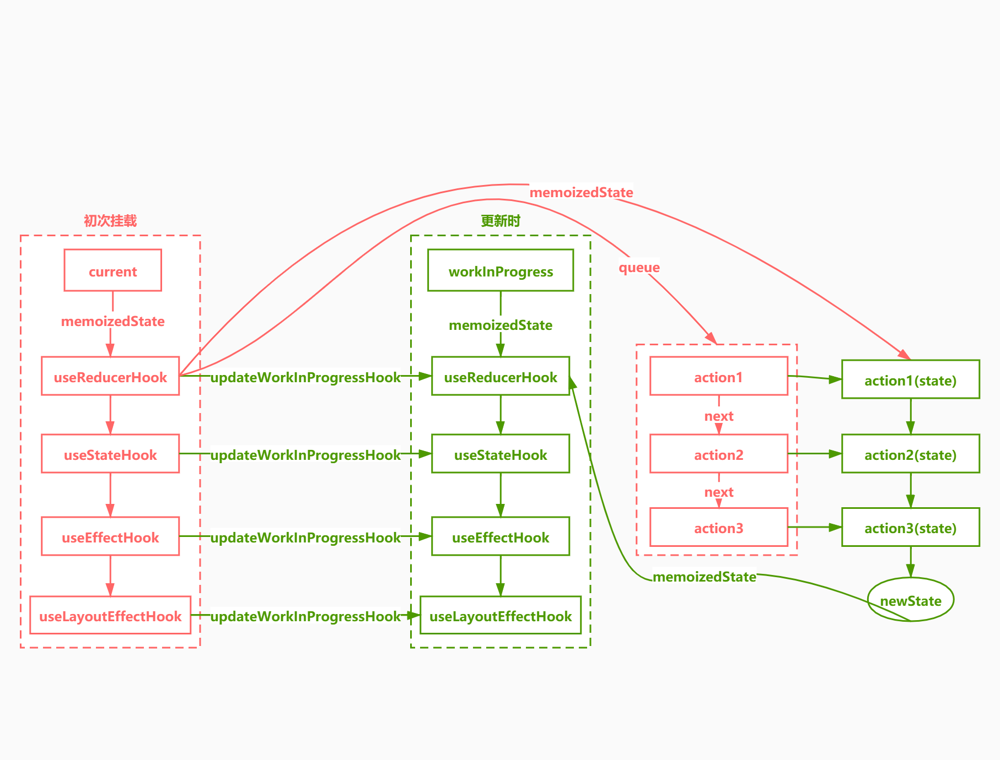

reducer 更新逻辑：调用`renderWithHooks`以后，判断是否有老的 fiber，还有 fiber 的 memoizedState 状态，（**fiber和hook上都有memoizedState属性，fiber.memoizedState对应的是hook链表，hook.memoizedState对应的是state**），调用`HooksDispatcherOnUpdate`，走更新逻辑,调用`updateWorkInProgressHook`函数，通过当前 Fiber 的 alternate 获取老 Fiber，通过老 Fiber 上的 memoizedState 获取 hook，通过老 hook，创建新 hook，然后赋值 workInProgressHook，创建单向链表，执行 useReducer 方法的派发,此流程`useState`和`useReducer`方法通用

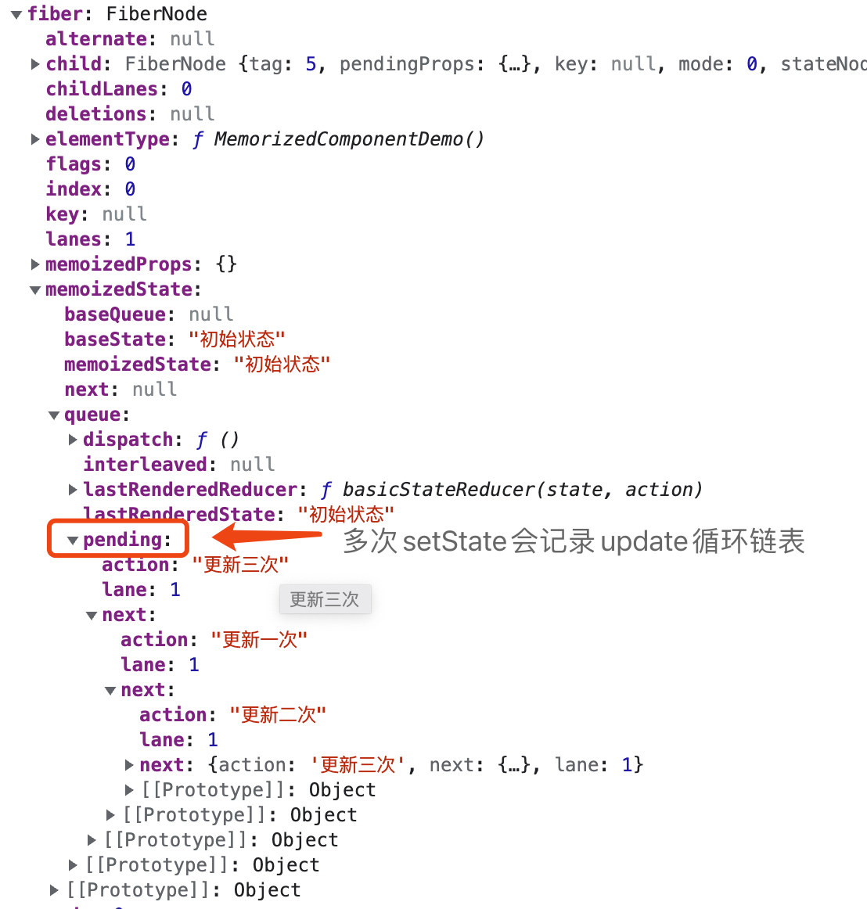

`currentlyRenderingFiber`就是`workInProgress`，`workInProgress`存在就代表当前是`render`阶段，触发更新的时候，通过`bind`绑定的`fiber`与`workInProgress`全等

```javaScript
/**
 * 构建新的hooks
 */
function updateWorkInProgressHook() {
  //获取将要构建的新的hook的老hook
  if (currentHook === null) {
    const current = currentlyRenderingFiber.alternate;
    currentHook = current.memoizedState;
  } else {
    currentHook = currentHook.next;
  }
  //根据老hook创建新hook
  const newHook = {
    memoizedState: currentHook.memoizedState,
    queue: currentHook.queue,
    next: null,
    baseState: currentHook.baseState,
    baseQueue: currentHook.baseQueue,
  };
  if (workInProgressHook === null) {
    currentlyRenderingFiber.memoizedState = workInProgressHook = newHook;
  } else {
    workInProgressHook = workInProgressHook.next = newHook;
  }
  return workInProgressHook;
}
```
`updateReducer`方法，概括一句话就是**找到对应的hook，根据update计算该hook的新state返回**

```javaScript
function updateReducer(reducer) {
  // 获取新的hook
  const hook = updateWorkInProgressHook();
  // 获取hook 的更新队列
  const queue = hook.queue;
  queue.lastRenderedReducer = reducer;
  // 获取老的hook
  const current = currentHook;
  let baseQueue = current.baseQueue;
  // 获取更新队列，第一个都是指向最新的
  const pendingQueue = queue.pending;
  //把新旧更新链表合并
  if (pendingQueue !== null) {
    if (baseQueue !== null) {
      const baseFirst = baseQueue.next;
      // 拿到第一个更新
      const pendingFirst = pendingQueue.next;
      baseQueue.next = pendingFirst;
      pendingQueue.next = baseFirst;
    }
    current.baseQueue = baseQueue = pendingQueue;
    // 队列清空
    queue.pending = null;
  }
  if (baseQueue !== null) {
    printQueue(baseQueue);
    const first = baseQueue.next;
    let newState = current.baseState;
    let newBaseState = null;
    let newBaseQueueFirst = null;
    let newBaseQueueLast = null;
    let update = first;
    do {
      const updateLane = update.lane;
      const shouldSkipUpdate = !isSubsetOfLanes(renderLanes, updateLane);
      if (shouldSkipUpdate) {
        const clone = {
          lane: updateLane,
          action: update.action,
          hasEagerState: update.hasEagerState,
          eagerState: update.eagerState,
          next: null,
        };
        if (newBaseQueueLast === null) {
          newBaseQueueFirst = newBaseQueueLast = clone;
          newBaseState = newState;
        } else {
          newBaseQueueLast = newBaseQueueLast.next = clone;
        }
        currentlyRenderingFiber.lanes = mergeLanes(
          currentlyRenderingFiber.lanes,
          updateLane
        );
      } else {
        if (newBaseQueueLast !== null) {
          const clone = {
            lane: NoLane,
            action: update.action,
            hasEagerState: update.hasEagerState,
            eagerState: update.eagerState,
            next: null,
          };
          newBaseQueueLast = newBaseQueueLast.next = clone;
        }
        if (update.hasEagerState) {
          newState = update.eagerState;
        } else {
          // 派发的动作
          const action = update.action;
          // 计算新状态
          newState = reducer(newState, action);
        }
      }
      update = update.next;
    // 从头循环到尾
    } while (update !== null && update !== first);
    if (newBaseQueueLast === null) {
      newBaseState = newState;
    } else {
      newBaseQueueLast.next = newBaseQueueFirst;
    }
    // 设置新状态
    hook.memoizedState = newState;
    hook.baseState = newBaseState;
    hook.baseQueue = newBaseQueueLast;
    queue.lastRenderedState = newState;
  }
  if (baseQueue === null) {
    queue.lanes = NoLanes;
  }
  const dispatch = queue.dispatch;
  return [hook.memoizedState, dispatch];
}
```
以官网的reducer举例

```javaScript
function reducer(state:any, action:any) {
  switch (action.type) {
    case 'increment':
      return {count: state.count + 1};
    case 'decrement':
      return {count: state.count - 1};
    default:
      throw new Error();
  }
}

export default () => {
  const [state, dispatch] = useReducer(reducer, initialState);
  return (
    <>
      <button onClick={() =>
        {
          dispatch({type: 'increment'})
          dispatch({type: 'decrement'})
        }}>{state.count}</button>
    </>
  );
}
```
`updateQueue`第一个永远指向最新的状态

```javaScript
{
  baseQueue:null,
  baseState:{
    count:0
  },
  memoizedState:{
    count:0
  },
  next:null,
  queue:{
    dispatch:()=>{},
    lastRenderedReducer:(state,action)=>();
    lastRenderedState:{
      count:0
    },
    pending:{
      action:{
        type:"decrement",
        eagerState:null,
        hasEagerState:false,
        lane:1,
        next:{
          type:"increment",
          eagerState:null,
          hasEagerState:false,
          lane:1,
          next:{
            // 环形链表
            ...
          }
        }
      }
    }
  }
}
```

### dispatchAction

执行派发更新逻辑


```javaScript
/**
 * 执行派发动作的方法，它要更新状态，并且让界面重新更新
 * @param {*} fiber function对应的fiber
 * @param {*} queue 当前hook对应的更新队列
 * @param {*} action 派发的函数
 */
function dispatchReducerAction(fiber, queue, action) {
  //在每个hook里会存放一个更新队列，更新队列是一个更新对象的循环链表update1.next=update2.next=update1
  const update = {
    action, //{ type: 'add', payload: 1 } 派发的动作
    next: null, //指向下一个更新对象
  };
  //把当前的最新的更添的添加更新队列中，并且返回当前的根fiber
  const root = enqueueConcurrentHookUpdate(fiber, queue, update);
  const eventTime = requestEventTime();
  // 从root开始更新
  scheduleUpdateOnFiber(root, fiber, lane, eventTime);
}

/**
 * 把更新队列添加到更新队列中
 * @param {*} fiber 函数组件对应的fiber
 * @param {*} queue 要更新的hook对应的更新队列
 * @param {*} update 更新对象
 */
export function enqueueConcurrentHookUpdate(fiber, queue, update, lane) {
  enqueueUpdate(fiber, queue, update, lane);
  return getRootForUpdatedFiber(fiber);
}
```

```javaScript
/**
 * @param {*} fiber
 * @param {*} queue
 * @param {*} update
 */
function enqueueUpdate(updateQueue, update, fiber, lane) {
const pending = updateQueue.shared.pending;
	if (pending === null) {
		// pending = a -> a
		update.next = update;
	} else {
		// pending = b -> a -> b
		// pending = c -> a -> b -> c
		update.next = pending.next;
		pending.next = update;
	}
	updateQueue.shared.pending = update;

	fiber.lanes = mergeLanes(fiber.lanes, lane);
	const alternate = fiber.alternate;
	if (alternate !== null) {
		alternate.lanes = mergeLanes(alternate.lanes, lane);
	}
}
```

调用 `getRootForUpdatedFiber`，从当前的 fiber 找到 hostRoot，也就是根节点（FiberRootNode）, div #root，进行调度更新

```javaScript
function getRootForUpdatedFiber(sourceFiber) {
  let node = sourceFiber;
  let parent = node.return;
  while (parent !== null) {
    node = parent;
    parent = node.return;
  }
  return node.tag === HostRoot ? node.stateNode : null;  //FiberRootNode div#root
}
```

## useState
<!--
 * @Author: changcheng
 * @LastEditTime: 2023-10-04 21:59:45
-->
### mountState & updateState

+ mount阶段

`useState`和`useReducer`区别不大，其中`useReducer`的`lastRenderedReducer`为传入的reducer参数，`useState`的`lastRenderedReducer`为`basicStateReducer`

```javaScript
/**
 * hook的属性
 * hook.memoizedState 当前 hook真正显示出来的状态
 * hook.baseState 第一个跳过的更新之前的老状态
 * hook.queue.lastRenderedState 上一个计算的状态
 */
function mountState(initialState) {
  const hook = mountWorkInProgressHook();
  hook.memoizedState = hook.baseState = initialState;
  const queue = {
    pending: null,
    dispatch: null,
    lastRenderedReducer: baseStateReducer, //上一个reducer
    lastRenderedState: initialState, //上一个state
  };
  hook.queue = queue;
  const dispatch = (queue.dispatch = dispatchSetState.bind(
    null,
    currentlyRenderingFiber,
    queue
  ));
  return [hook.memoizedState, dispatch];
}
```
`dispatchSetState`用来更新`useState`状态

```javaScript
function dispatchSetState(fiber, queue, action) {
  // 获取当前的更新赛道 1
  const lane = requestUpdateLane();
  const update = {
    lane,//本次更新优先级就是1
    action,
    hasEagerState: false,//是否有急切的更新
    eagerState: null,//急切的更新状态
    next: null
  }
  const alternate = fiber.alternate;

  //当你派发动作后，我立刻用上一次的状态和上一次的reducer计算新状态
  //只要第一个更新都能进行此项优化
  if (fiber.lanes === NoLanes && (alternate === null || alternate.lanes == NoLanes)) {
    //先获取队列上的老的状态和老的reducer
    const { lastRenderedReducer, lastRenderedState } = queue;
    //使用上次的状态和上次的reducer结合本次action进行计算新状态
    const eagerState = lastRenderedReducer(lastRenderedState, action);
    update.hasEagerState = true;
    update.eagerState = eagerState;
    if (Object.is(eagerState, lastRenderedState)) {
      return;
    }
  }
  //下面是真正的入队更新，并调度更新逻辑
  const root = enqueueConcurrentHookUpdate(fiber, queue, update, lane);
  const eventTime = requestEventTime();
  scheduleUpdateOnFiber(root, fiber, lane, eventTime);
}
```

+ update阶段

在mount阶段，这两者还有区别，但是在update的时候，useState和useReducer调用的同一个函数`updateReducer`


```javaScript
//useState其实就是一个内置了reducer的useReducer
function baseStateReducer(state, action) {
  return typeof action === 'function' ? action(state) : action;
}
function updateState(initialState) {
  return updateReducer(baseStateReducer, initialState);
}
```

## mountEffect & updateEffecr
### useEffect

1. 在函数组件主体内（这里指在 React 渲染阶段）改变 DOM、添加订阅、设置定时器、记录日志以及执行其他包含副作用的操作都是不被允许的，因为这可能会产生莫名其妙的 bug 并破坏 UI 的一致性

2. 使用 useEffect 完成副作用操作。赋值给 useEffect 的函数会在组件渲染到屏幕之后执行。你可以把 effect 看作从 React 的纯函数式世界通往命令式世界的逃生通道

3. useEffect 就是一个 Effect Hook，给函数组件增加了操作副作用的能力。它跟 class 组件中的 componentDidMount、componentDidUpdate 和 componentWillUnmount 具有相同的用途，只不过被合并成了一个 API

4. 该 Hook 接收一个包含命令式、且可能有副作用代码的函数

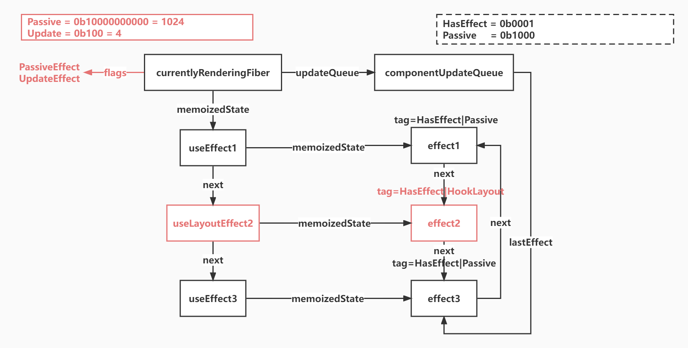

### mountEffect

挂载`effect`

```javaScript
function mountEffect(create, deps) {
  return mountEffectImpl(PassiveEffect, HookPassive, create, deps);
}
/* function mountLayoutEffect(create, deps) {
  return mountEffectImpl(PassiveEffect, HookPassive, create, deps);
} */
function mountEffectImpl(fiberFlags, hookFlags, create, deps) {
  const hook = mountWorkInProgressHook();
  const nextDeps = deps === undefined ? null : deps;
  //给当前的函数组件fiber添加flags
  currentlyRenderingFiber.flags |= fiberFlags;
  hook.memoizedState = pushEffect(HookHasEffect | hookFlags, create, undefined, nextDeps);
}
/**
 * 创建函数组件的更新队列
 */
function createFunctionComponentUpdateQueue() {
  return {
    lastEffect: null
  }
}
```

### updateEffect

和`mountEffect`区别就是，要获取老的`effect`对象，拿到`deps`与`destroy`方法

```javaScript
function updateEffect(create, deps) {
  return updateEffectImpl(PassiveEffect, HookPassive, create, deps);
}
function updateEffectImpl(fiberFlags, hookFlags, create, deps) {
  const hook = updateWorkInProgressHook();
  const nextDeps = deps === undefined ? null : deps;
  let destroy;
  //上一个老hook
  if (currentHook !== null) {
    //获取此useEffect这个Hook上老的effect对象 create deps destroy
    const prevEffect = currentHook.memoizedState;
    destroy = prevEffect.destroy;
    if (nextDeps !== null) {
      const prevDeps = prevEffect.deps;
      // 用新数组deps和老数组deps进行对比，如果一样的话，跳过，不需要执行后面的pushEffect逻辑
      if (areHookInputsEqual(nextDeps, prevDeps)) {
        //不管要不要重新执行，都需要把新的effect组成完整的循环链表放到fiber.updateQueue中，这里传入hookFlags可以在后面commitHookEffectListMount跳过执行effect函数
        hook.memoizedState = pushEffect(hookFlags, create, destroy, nextDeps);
        return;
      }
    }
  }
  //如果要执行的话需要修改fiber的flags
  currentlyRenderingFiber.flags |= fiberFlags;
  //如果要执行的话 添加HookHasEffect flag
  //Passive还需HookHasEffect,因为不是每个Passive都会执行的，这里代表有effect执行
  hook.memoizedState = pushEffect(HookHasEffect | hookFlags, create, destroy, nextDeps);
}
```
添加`effect`链表

```javaScript
/**
 * 添加effect链表，循环链表
 * @param {*} tag effect的标签
 * @param {*} create 创建方法
 * @param {*} destroy 销毁方法
 * @param {*} deps 依赖数组
 */
function pushEffect(tag, create, destroy, deps) {
  const effect = {
    tag,
    create,
    destroy,
    deps,
    next: null
  }
  let componentUpdateQueue = currentlyRenderingFiber.updateQueue;
  if (componentUpdateQueue === null) {
    componentUpdateQueue = createFunctionComponentUpdateQueue();
    currentlyRenderingFiber.updateQueue = componentUpdateQueue;
    componentUpdateQueue.lastEffect = effect.next = effect;
  } else {
    const lastEffect = componentUpdateQueue.lastEffect;
    if (lastEffect === null) {
      componentUpdateQueue.lastEffect = effect.next = effect;
    } else {
      const firstEffect = lastEffect.next;
      lastEffect.next = effect;
      effect.next = firstEffect;
      componentUpdateQueue.lastEffect = effect;
    }
  }
  return effect;
}
```

### 执行effect的create方法和destory方法

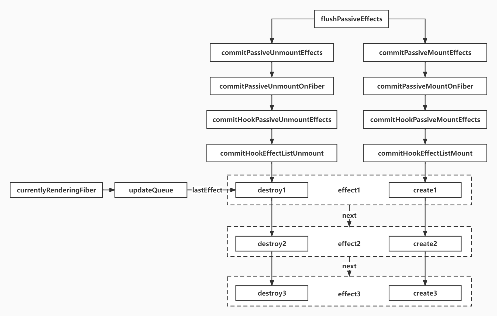

在`commitRootImpl`执行中，先通过`finishedWork.subtreeFlags & Passive`|| `finishedWork.flags & Passive) !== NoFlags`，通过`scheduleCallback`函数开启宏任务，执行`flushPassiveEffect`

```javaScript
function commitRootImpl(root) {
  //先获取新的构建好的fiber树的根fiber tag=3
  const { finishedWork } = root;
  workInProgressRoot = null;
  workInProgressRootRenderLanes = NoLanes;
  root.callbackNode = null;
  root.callbackPriority = NoLane;
  //合并统计当前新的根上剩下的车道
  const remainingLanes = mergeLanes(
    finishedWork.lanes,
    finishedWork.childLanes
  );
  markRootFinished(root, remainingLanes);
  if (
    (finishedWork.subtreeFlags & Passive) !== NoFlags ||
    (finishedWork.flags & Passive) !== NoFlags
  ) {
    // 根节点是否有effect副作用
    if (!rootDoesHavePassiveEffect) {
      rootDoesHavePassiveEffect = true;
      Scheduler_scheduleCallback(NormalSchedulerPriority, flushPassiveEffect);
    }
  }
  //判断子树有没有副作用
  const subtreeHasEffects =
    (finishedWork.subtreeFlags & MutationMask) !== NoFlags;
  const rootHasEffect = (finishedWork.flags & MutationMask) !== NoFlags;
  //如果自己的副作用或者子节点有副作用就进行提交DOM操作
  if (subtreeHasEffects || rootHasEffect) {
    //当DOM执行变更之后
    commitMutationEffectsOnFiber(finishedWork, root);
    //执行layout Effect
    commitLayoutEffects(finishedWork, root);
    // 重置根节点effect标识
    if (rootDoesHavePassiveEffect) {
      rootDoesHavePassiveEffect = false;
      // 同时赋值为根节点
      rootWithPendingPassiveEffects = root;
    }
  }
  //等DOM变更后，就可以把让root的current指向新的fiber树
  root.current = finishedWork;
  //在提交之后，因为根上可能会有跳过的更新，所以需要重新再次调度
  ensureRootIsScheduled(root, now());
}
```

### flushPassiveEffect

执行effect的`create`方法和`destory`方法，先执行所有的`destory`方法，再执行`create`方法。

```javaScript
function flushPassiveEffect() {
  if (rootWithPendingPassiveEffects !== null) {
    const root = rootWithPendingPassiveEffects;
    //执行卸载副作用，destroy
    commitPassiveUnmountEffects(root.current);
    //执行挂载副作用 create
    commitPassiveMountEffects(root, root.current);
  }
}
```

### commitPassiveUnmountOnFiber & commitPassiveMountEffects

`commitPassiveUnmountEffects`与`commitPassiveMountEffects`几乎一致，都是通过调用`recursivelyTraversePassiveUnmountEffects`，从根节点往下遍历节点

```javaScript
function commitPassiveUnmountOnFiber(finishedWork) {
  const flags = finishedWork.flags;
  switch (finishedWork.tag) {
    case HostRoot: {
      recursivelyTraversePassiveUnmountEffects(finishedWork);
      break;
    }
    case FunctionComponent: {
      recursivelyTraversePassiveUnmountEffects(finishedWork);
      if (flags & Passive) {//1024
        commitHookPassiveUnmountEffects(finishedWork, HookHasEffect | HookPassive);
      }
      break;
    }
  }
}
// 遍历节点
function recursivelyTraversePassiveUnmountEffects(parentFiber) {
  if (parentFiber.subtreeFlags & Passive) {
    let child = parentFiber.child;
    while (child !== null) {
     // 重新回到commitPassiveUnmountOnFiber函数，继续递归
      commitPassiveUnmountOnFiber(child);
      child = child.sibling;
    }
  }
}
```

### commitPassiveMountEffects & commitPassiveUnmountEffects

`commitPassiveMountEffects`与`commitPassiveUnmountEffects`几乎一致，唯一的区别，一个是调用`destroy`方法，一个调用`create`方法，都是通过`finishedWork`的`updateQueue`拿到更新队列，进行更新，与`useReducer`与`useState`更新方法基本一致，都是循环链表

```javaScript
function commitHookEffectListMount(flags, finishedWork) {
  const updateQueue = finishedWork.updateQueue;
  const lastEffect = updateQueue !== null ? updateQueue.lastEffect : null;
  if (lastEffect !== null) {
    //获取 第一个effect
    const firstEffect = lastEffect.next;
    let effect = firstEffect;
    do {
      //如果此 effect类型和传入的相同，都是 9 HookHasEffect | PassiveEffect
      if ((effect.tag & flags) === flags) {
        const create = effect.create;
        // 拿到create的结果也就是destory函数    
        effect.destroy = create();
      }
      effect = effect.next;
    } while (effect !== firstEffect)
  }
}
```

## useLayoutEffect

### mountUseLayoutEffect & updateUseLayoutEffect

1. 其函数签名与 useEffect 相同，但它会在所有的 DOM 变更之后同步调用 effect

2. useEffect不会阻塞浏览器渲染，而 useLayoutEffect 会浏览器渲染

3. useEffect会在浏览器渲染结束后执行,useLayoutEffect 则是在 DOM 更新完成后,浏览器绘制之前执行

`mountLayoutEffect`函数与`mountEffect`相比，这里的区别是一个传入了`UpdateEffect`标识一个传入了`PassiveEffect`标识

```javaScript
function mountLayoutEffect(create, deps) {
  return mountEffectImpl(UpdateEffect, HookLayout, create, deps);
}
```
在执行完`commitMutationEffectsOnFiber`函数，DOM进行变更，但是还没有渲染之前，执行`commitLayoutEffects`

```javaScript
function commitRootImpl(root) {
  //先获取新的构建好的fiber树的根fiber tag=3
  const { finishedWork } = root;
  workInProgressRoot = null;
  workInProgressRootRenderLanes = NoLanes;
  root.callbackNode = null;
  root.callbackPriority = NoLane;
  //合并统计当前新的根上剩下的车道
  const remainingLanes = mergeLanes(
    finishedWork.lanes,
    finishedWork.childLanes
  );
  markRootFinished(root, remainingLanes);
  if (
    (finishedWork.subtreeFlags & Passive) !== NoFlags ||
    (finishedWork.flags & Passive) !== NoFlags
  ) {
    if (!rootDoesHavePassiveEffect) {
      rootDoesHavePassiveEffect = true;
      Scheduler_scheduleCallback(NormalSchedulerPriority, flushPassiveEffect);
    }
  }
  //判断子树有没有副作用
  const subtreeHasEffects =
    (finishedWork.subtreeFlags & MutationMask) !== NoFlags;
  const rootHasEffect = (finishedWork.flags & MutationMask) !== NoFlags;
  //如果自己的副作用或者子节点有副作用就进行提交DOM操作
  if (subtreeHasEffects || rootHasEffect) {
    //当DOM执行变更之后
    commitMutationEffectsOnFiber(finishedWork, root);
    //执行layout Effect
    commitLayoutEffects(finishedWork, root);
    if (rootDoesHavePassiveEffect) {
      rootDoesHavePassiveEffect = false;
      rootWithPendingPassiveEffects = root;
    }
  }
  //等DOM变更后，就可以把让root的current指向新的fiber树
  root.current = finishedWork;
  //在提交之后，因为根上可能会有跳过的更新，所以需要重新再次调度
  ensureRootIsScheduled(root, now());
}
```
## DomDiff

DomDiff 的过程其实就是老的 Fiber 树 和 新的 jsx 对比生成新的 Fiber 树 的过程，分为单节点和多节点两种分别对应**reconcileSingleElement**和**reconcileChildrenArray**

**只对同级元素进行比较**

**不同的类型对应不同的元素**

**可以通过 key 来标识同一个节点**

### 单节点

+ 新旧节点 type 和 key 都不一样，标记为删除

+ 如果对比后发现新老节点一样的，那么会复用老节点，复用老节点的 DOM 元素和 Fiber 对象
再看属性有无变更 ，如果有变化，则会把此 Fiber 节点标准为更新

+ 如果 key 相同，但是 type 不同，则不再进行后续对比了，
直接把老的节点全部删除

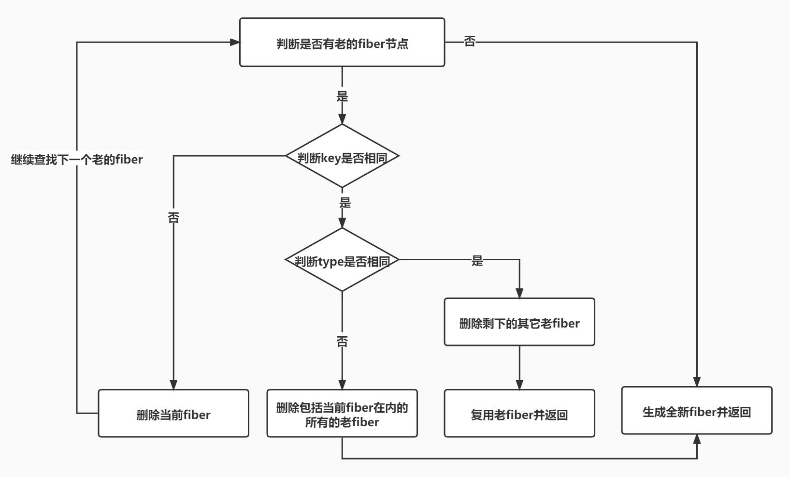

```javaScript

  function reconcileSingleElement(
    returnFiber: Fiber,
    currentFirstChild: Fiber | null,
    element: ReactElement
  ): Fiber {
    const key = element.key;
    let child = currentFirstChild;
    // 首先判断是否存在对应DOM节点
    while (child !== null) {
      // 上一次更新存在DOM节点，接下来判断是否可复用
      // 首先比较key是否相同
      if (child.key === key) {
        // key相同，接下来比较type是否相同
        switch (child.tag) {
          // ...省略case
          default: {
            if (child.elementType === element.type) {
              // type相同则表示可以复用
              // 删除剩下的兄弟节点
               deleteRemainingChildren(returnFiber, child.sibling)
               // 复用fiber，更新props
               const existing = useFiber(child, element.props)
               existing.return = returnFiber
               return existing
            }
            //key相同但是type变了，直接停止遍历，把后面的节点都删了
            deleteRemainingChildren(returnFiber, child)
            break
          }
        }
        // 代码执行到这里代表：key相同但是type不同
        // 将该fiber及其兄弟fiber标记为删除
        deleteRemainingChildren(returnFiber, child);
        break;
      } else {
        // key不同，将该fiber标记为删除
        deleteChild(returnFiber, child);
      }
      child = child.sibling;
    }
    //一个都不能复用，直接重新创建一个，根据jsx创建fiber节点
    const created = createFiberFromElement(element, returnFiber.mode, lanes)
    // 建立与父级的关系
    created.return = returnFiber
    return created
  }

```

### 多节点

DOM DIFF 的三个规则

+ 只对同级元素进行比较，不同层级不对比
+ 不同的类型对应不同的元素
+ 可以通过 key 来标识同一个节点

第 1 轮遍历

+ 如果 key 不同则直接结束本轮循环
+ newChildren 或 oldFiber 遍历完，结束本轮循环
+ key 相同而 type 不同，标记老的 oldFiber 为删除，继续循环
+ key 相同而 type 也相同，则可以复用老节 oldFiber 节点，继续循环

第 2 轮遍历

+ newChildren 遍历完而 oldFiber 还有，遍历剩下所有的 oldFiber 标记为删除，DIFF 结束
+ oldFiber 遍历完了，而 newChildren 还有，将剩下的 newChildren 标记为插入，DIFF 结束
+ newChildren 和 oldFiber 都同时遍历完成，diff 结束
+ newChildren 和 oldFiber 都没有完成，则进行节点移动的逻辑

第 3 轮遍历

+ 处理节点移动的情况

```javaScript

  // 之前
  abcd
  // 之后
  acdb

  ===第一轮遍历开始===
  a（之后）vs a（之前）
  key不变，可复用
  此时 a 对应的oldFiber（之前的a）在之前的数组（abcd）中索引为0
  所以 lastPlacedIndex = 0;

  继续第一轮遍历...

  c（之后）vs b（之前）
  key改变，不能复用，跳出第一轮遍历
  此时 lastPlacedIndex === 0;
  ===第一轮遍历结束===

  ===第二轮遍历开始===
  newChildren === cdb，没用完，不需要执行删除旧节点
  oldFiber === bcd，没用完，不需要执行插入新节点

  将剩余oldFiber（bcd）保存为map

  // 当前oldFiber：bcd
  // 当前newChildren：cdb

  继续遍历剩余newChildren

  key === c 在 oldFiber中存在
  const oldIndex = c（之前）.index;
  此时 oldIndex === 2;  // 之前节点为 abcd，所以c.index === 2
  比较 oldIndex 与 lastPlacedIndex;

  如果 oldIndex >= lastPlacedIndex 代表该可复用节点不需要移动
  并将 lastPlacedIndex = oldIndex;
  如果 oldIndex < lastplacedIndex 该可复用节点之前插入的位置索引小于这次更新需要插入的位置索引，代表该节点需要向右移动

  在例子中，oldIndex 2 > lastPlacedIndex 0，
  则 lastPlacedIndex = 2;
  c节点位置不变

  继续遍历剩余newChildren

  // 当前oldFiber：bd
  // 当前newChildren：db

  key === d 在 oldFiber中存在
  const oldIndex = d（之前）.index;
  oldIndex 3 > lastPlacedIndex 2 // 之前节点为 abcd，所以d.index === 3
  则 lastPlacedIndex = 3;
  d节点位置不变

  继续遍历剩余newChildren

  // 当前oldFiber：b
  // 当前newChildren：b

  key === b 在 oldFiber中存在
  const oldIndex = b（之前）.index;
  oldIndex 1 < lastPlacedIndex 3 // 之前节点为 abcd，所以b.index === 1
  则 b节点需要向右移动
  ===第二轮遍历结束===

  最终acd 3个节点都没有移动，b节点被标记为移动

```

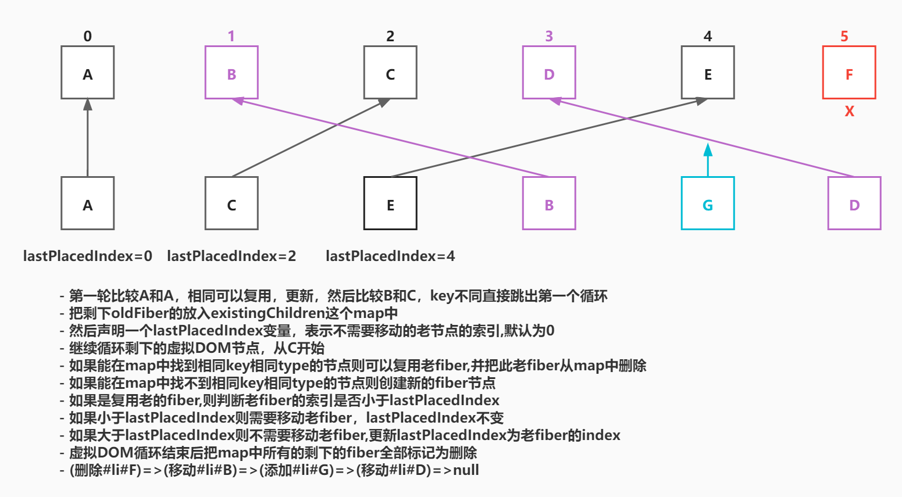

```javaScript

      function reconcileChildrenArray(returnFiber, currentFirstChild, newChildren) {
        //将要返回的第一个新fiber，也就是workInProgress
        let resultingFirstChild = null;
        //上一个新fiber
        let previousNewFiber = null;
        //当前的老fiber
        let oldFiber = currentFirstChild;
        //下一个老fiber
        let nextOldFiber = null;
        //新的虚拟DOM的索引
        let newIdx = 0;
        // 新的Fiber节点在老的Fiber节点中的索引位置，用来处理Fiber节点位置的变化，也就是oldFiber index
        let lastPlacedIndex = 0;
        //处理更新的情况 老fiber和新fiber都存在
        for (; oldFiber && newIdx < newChildren.length; newIdx++) {
            //先缓存下一个老fiber
            nextOldFiber = oldFiber.sibling;
            //  判断该对应位置的fiber是否可以复用
            //  只有type相同且key也相同的情况下才会复用
            //  diff函数会根据该函数的返回值进行相关的操作
            //  如果key不相同直接返回null代表可能节点的位置发生了变更，
            //  简单的循环是行不通的所以待会会进入updateFromMap逻辑，
            //  如果是key相同但是type变了就选择不复用，而是选择重新创建一个元素返回
            //  就会将以前同key的元素标记为删除
            const newFiber = updateSlot(returnFiber, oldFiber, newChildren[newIdx]);
            //如果key 不一样，直接跳出第一轮循环
            if (!newFiber)
                break;
            //老fiber存在，但是新节点没有alternate，说明是新创建的节点，将老Fiber标记为删除，继续遍历
            if (oldFiber && !newFiber.alternate) {
                deleteChild(returnFiber, oldFiber);
            }
              //  如果是首次mount则 lastPlacedIndex没有意义，该值主要用来判断该节点在这次更新后
              //  是不是原来在他后面的节点，现在跑到他前面了如果是他就是需要重新插入dom树的
              //  那么怎么判断他后面的节点是不是跑到他前面了呢，考虑以下情况
              //  更新前: 1 -> 2 -> 3 -> 4
              //  更新后: 1 -> 3 -> 2 -> 4
              //  在处理该次更新时，当遍历到2时，此时lastPlacedIndex为2，而2的oldIndex为1
              //  所以可以判断到newFiber.oldIndex<lastPlacedIndex，老的Fiber对应的真实dom需要移动了
              //  但是现在跑到他前面了，所以newFiber也就是2是需要重新插入dom树的
              //  在commit阶段时，对2相应的dom进行重新插入时，
              //  会寻找他后面第一个不需要进行插入操作的dom元素作为insertBefore
              //  的第二个参数，所以2对应的dom会被插入到4前面

            lastPlacedIndex = placeChild(newFiber, lastPlacedIndex, newIdx);
            if (previousNewFiber === null) {
                resultingFirstChild = newFiber;
            } else {
                previousNewFiber.sibling = newFiber;
            }
            previousNewFiber = newFiber;
            oldFiber = nextOldFiber;
        }
        // 老Fiber和新Fiber同时遍历完成，删除剩下的oldFiber就行
        if (newIdx === newChildren.length) {
            deleteRemainingChildren(returnFiber, oldFiber);
            return resultingFirstChild;
        }
        //如果老Fiber是遍历完的，但是新的Fiber还没遍历完，第一次挂载其实也是在这里的逻辑，因为没有oldFiber
        if (oldFiber === null) {
            //循环虚拟DOM数组， 为每个虚拟DOM创建一个新的fiber
            for (; newIdx < newChildren.length; newIdx++) {
                const newFiber = createChild(returnFiber, newChildren[newIdx]);
                lastPlacedIndex = placeChild(newFiber, lastPlacedIndex, newIdx);
                if (!previousNewFiber) {
                    resultingFirstChild = newFiber;
                } else {
                    previousNewFiber.sibling = newFiber;
                }
                previousNewFiber = newFiber;
            }
            return resultingFirstChild;
        }
        //将剩下的老fiber放入map中 {key:key,value:Fiber}
        const existingChildren = mapRemainingChildren(returnFiber, oldFiber);
        for (; newIdx < newChildren.length; newIdx++) {
            //去map中找找有没key相同并且类型相同可以复用的老fiber 老真实DOM
            const newFiber = updateFromMap(existingChildren, returnFiber, newIdx, newChildren[newIdx]);
            if (newFiber !== null) {
                //说明是复用的老fiber
                if (newFiber.alternate) {
                    existingChildren.delete(newFiber.key || newIdx);
                }
                lastPlacedIndex = placeChild(newFiber, lastPlacedIndex, newIdx);
                if (previousNewFiber === null) {
                    resultingFirstChild = newFiber;
                } else {
                    previousNewFiber.sibling = newFiber;
                }
                previousNewFiber = newFiber;
            }
        }
        //map中剩下是没有被 复用的，全部删除
        existingChildren.forEach(child => deleteChild(returnFiber, child));
        return resultingFirstChild;
    }

```
