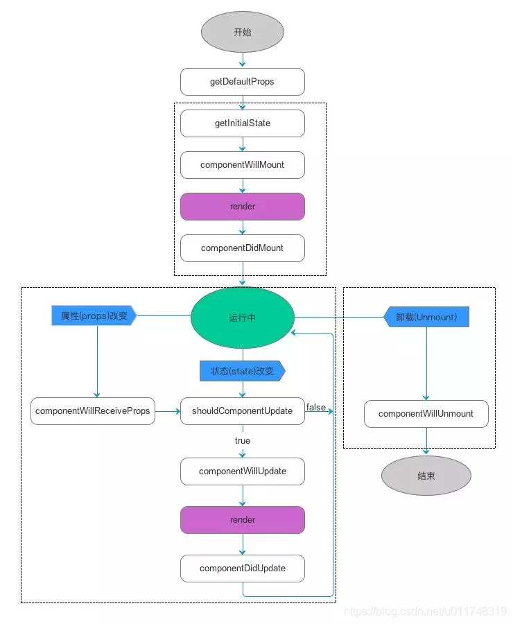
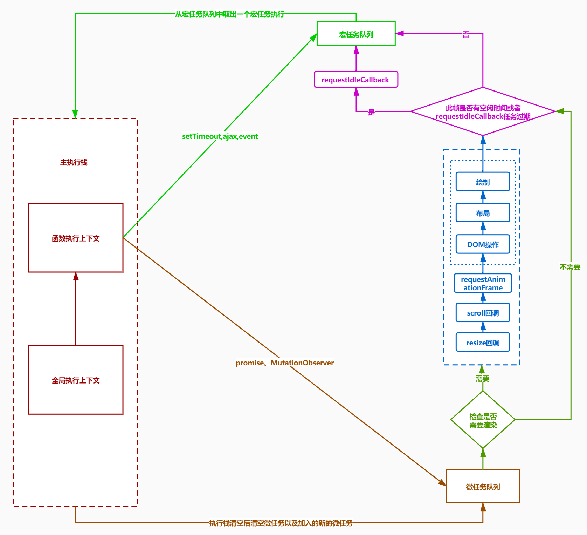

<!--
 * @Author: cc
 * @LastEditTime: 2022-06-07 11:44:09
-->

### React 源码解析

<br/>


```javaScript

// 真实Dom
 <div className="box" style={{color:'red'}}>
  <span>1</span>
  <p>2</p>
</div>

// 转换结果
 {
  type:"div",
  props:{
    className:"box"
  },
  children:[{
    type:"span",
    props:{
      style:{
        color:"red"
      },
      children:"hello"
    },
  },{
    type:"p",
    props:null,
    children:"2"
  }]
}
```

### React

1. React 元素不可变,不可以改变元素类型，例如{type:h1}修改为{type:h2}，禁止修改对象属性 Object.freeze(object)，其实就是改变 writeable 属性为 false

2. React 元素采用局部更新，只更新可变部分，domDiff,但是问题是更新的话，React 也要从组件的根节点更新，vue 是发布订阅，可以实现真正的局部更新

```javaScript
// 经典发布订阅结构
const list = [['国家大事',['小王']],['美女',['小常','小谢']]]
class EventBus {
  constructor() {
    this.eventBus = new Map();
  }
  on(eventName, message) {
    if (!this.eventBus.has(eventName)) {
      this.eventBus.set(eventName, []);
    }
    this.eventBus.get(eventName).push(message);
  }
  emit(eventName) {
    if (!this.eventBus.has(eventName)) return;
    for (let i = 0; i < this.eventBus.get(eventName).length; i++) {
      console.log(`${this.eventBus.get(eventName)[i]}收到${eventName}`);
    }
  }
}
let newEvent = new EventBus();
newEvent.on("国家大事", "小王");
newEvent.on("美女", "小常");
newEvent.on("美女", "小谢");
newEvent.emit("国家大事");
newEvent.emit("美女");
```

### 函数组件

1. 自定义组件必须是首字母大写 原生组件小写开头，自定义组件大写字母开头

2. 组件必须使用前先定义

3. 组件必须返回并且只能返回一个根元素

### 合成事件和批量更新


1. 在 React 中，事件的更新可能是异步的，是批量的，例如同时触发多个 setState

2. 调用 setState 状态并没有立刻更新，而是先缓存起来

3. 等事件处理函数执行完毕之后，再进行批量更新，一次更新并重新渲染

4. 因为 jsx 是由 React 函数控制，只要归 React 控制就是批量，只要不归 react 管，就是非批量

```javaScript
    this.setState({number:this.state.number+1});
    console.log(this.state.number); // 0
    this.setState({number:this.state.number+1});
    console.log(this.state.number); // 0
    // 第一个参数，获取最新的state
    // 第二个参数，回调函数，获取最新的state
    this.setState((lastState)=>{number:lastState.number+1},()=>{
        console.log(this.state.number) // 1
    })
     this.setState((lastState)=>{number:lastState.number+1},()=>{
        console.log(this.state.number) // 1
    })
    Promise.resolve().then(()=>{
        console.log(this.state.number); // 2
        this.setState({number:this.state.number+1});
        console.log(this.state.number); // 3
        sthis.etState({number:this.state.number+1});
        console.log(this.state.number); // 4
    })
```

### 父与子组件生命周期执行顺序

- 组件的调用顺序都是先父后子,渲染完成的顺序是先子后父。 组件的销毁操作是先父后子，销毁完成的顺序是先子后父

### react 老版生命周期

- 初始化：constructor -> componentWillMount->render->componentDidMount

- 更新：shouldComponentUpdate->componentWillUpdate->render->componentDidUpdate

- 卸载：componentWillUnmount

<br/>



<br/>

### react 新版生命周期

相对于老版，去除了几个 will 前缀生命周期,UNSAFE_componentWillUpdate,UNSAFE_componentWillMount,UNSAFE_componentWillReceiveProps。

- 创建时： constructor -> getDerivedStateFromProps -> render -> componentDidMount

- 更新时： getDerivedStateFromProps -> shouldComponentUpdate -> render -> getSnapShotBeforeUpdate -> componentDidUpdate

- 卸载时： componentWillUnmount

<br/>


<br/>

### componentWillReceiveProps 和 getDerivedStateFromProps 的区别

- componentWillReceiveProps(nextProps) 首次加载不会触发，父组件导致子组件更新时，即便 props 没变化，也会执行。

- getDerivedStateFromProps(nextProps, prevState) **首次加载**，**父组件更新**，**props**，**setState**，**forceUpdate** 都会触发，将父级传入的 props 映射到 state 上，新生命周期当中用来替代 componentWillReceiveProps,如果不改变，需要 return null

<br/>

### getSnapshotBeforeUpdate

- 获取 dom 更新前的信息，返回值传给 componentDidUpdate 第三个参数

<br/>

### React.createContext

- 创建执行上下文，用来向下传递属性，类组件可以挂载 contextType 静态属性，函数组件可以直接使用<Provider>和<Consumer>组件，主题切换之类的用的比较多

```javaScript
  let {Provider,Counsumer} = React.createContext(); // 返回{provider,consumer}
  <Provider value={color:'red',changeColor:this.changeColor}>
    <Child>
  </Provider>
  <Consumer>
    {
      ({color}=>{
        <p>{color}</p>
      })
    }
  </Consumer>
```

```javaScript
  //初始化默认值
  const MyContext = React.createContext({color:'red'});
  <MyContext.Provider value={color:'blue'}>
    <Child/>
  </MyContext.Provider>
  //另一种写法
  class Child extends React.Component {
    static contextType = MyContext;
    render() {
      let {color} = this.context;
    }
  }
```

### Fiber

### domDiff

https://mp.weixin.qq.com/s/Zi4spufaPxeZTMbjj_b55A


### 执行队列


