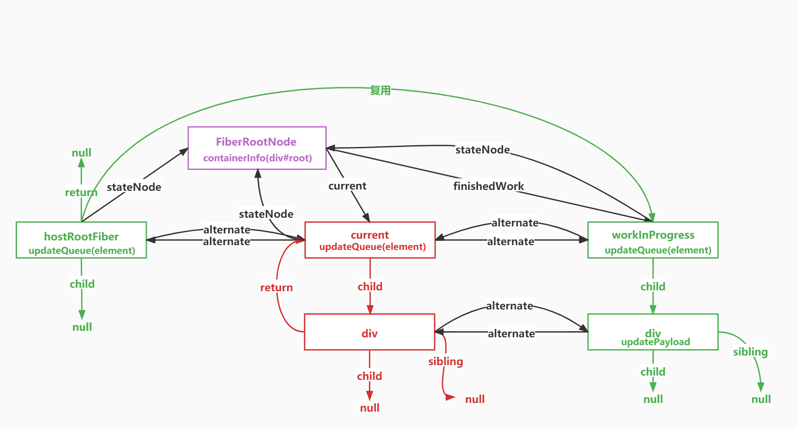
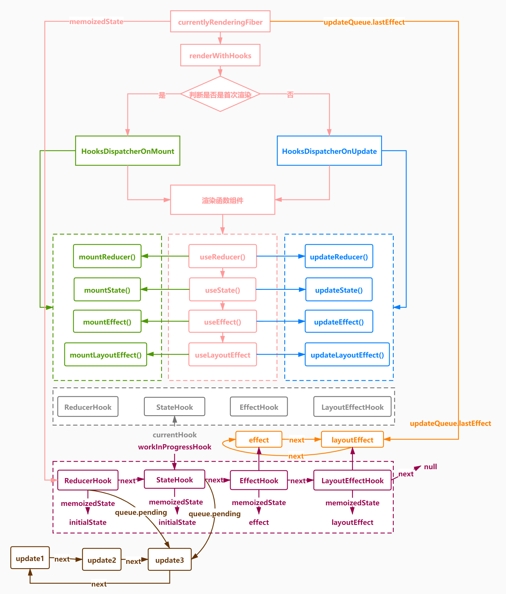
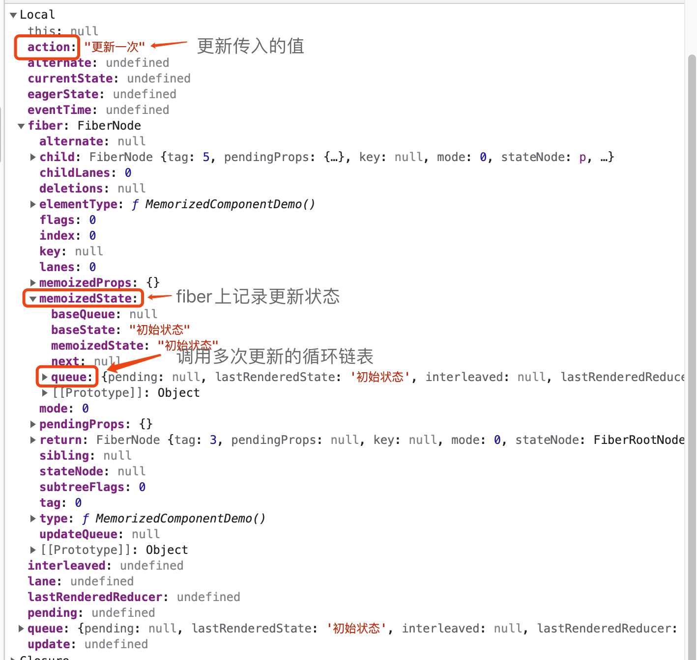

<!--
 * @Author: cc
 * @LastEditTime: 2022-11-15 10:54:14
-->

## React 工作循环


---

## 初始流程


React分为两种模式,render和createRoot两种入口,分为**legacy**和**concurrent**两种

+ legacy模式(同步)

render调用legacyRenderSubtreeIntoContainer，最后createRootImpl会调用到createFiberRoot创建fiberRootNode,然后调用createHostRootFiber创建rootFiber，其中fiberRootNode是整个项目的的根节点，rootFiber是当前应用挂在的节点，也就是ReactDOM.render调用后的根节点


+ concurrent模式(异步)

createRoot调用createRootImpl创建fiberRootNode和rootNode，在createRootImpl中调用listenToAllSupportedEvents初始化事件注册

创建完Fiber节点后，调用ReactDOMRoot.prototype.render执行updateContainer，然后scheduleUpdateOnFiber异步调度performConcurrentWorkOnRoot进入render阶段和commit阶段

+ 不同点

在函数scheduleUpdateOnFiber中根据不同优先级进入不同分支，legacy模式进入performSyncWorkOnRoot，concurrent模式会异步调度performConcurrentWorkOnRoot

---

## Fiber双缓存树

- current Fiber 树当渲染完毕后会生成一个 current Fiber 树

- workInProgress fiber 树在 render 阶段，会基于 current 树创建新的 workInProgress fiber 树赋值给 current Fiber 树

- workInProgress fiber 树的每个节点会有一个 alternate 指针指向 current 树赋给 current Fiber 树

- 构建完成后为finishedWork，完成的工作


## 
---

fiber更新逻辑

## 


---


## 函数渲染流程

+ 函数组件首次挂载，在renderWithHook中useState初始化，调用useStateOnMout,其他hook同理，声明currentlyRenderingFiber为workInProgress，同时调用mountWorkInProgressHook构建单向链表，判断是创建新的对应hook还是进行单向连接，返回workInProgressHook，声明queue队列，调用dispatchAction，将update加入queue队列，同时判断state值，判断是否跳过后续的scheduleUpdateOnFiber逻辑

## 

---

Fiber结构在函数中使用useState首次挂载

Function Component自己是没有状态的，它的状态来源于每次执行函数时，useState返回的内容

每个useState对应一个hook对象，当Funtion Component首次渲染时，会把所有的调用到的useState对应的hook对象，以链表的形式挂载到Fiber对应的memoizedState中,hook通过执行之后返回值得到状态和更改状态的方法

## 

---

多次通过useState调用更新

函数组件多次通过useState调用更新，通过Fiber的memoizedState的queue，构建多次调用更新的链表

## 

---

 函数组件的更新

## 

---

 dispatchAction如何执行？


链表是另一种形式的链表存储结构,模拟源码enqueueUpdate方法

它的特点是最后一个节点的指针区域指向头节点，整个链表形成一个环，永远指向最后一个更新

```javaScript
// pedding.next指向第一个第一个更新，更新顺序是不变的，此为环状列表
  function dispatchAction(queue,action){
    const update = {action,next:null};
    const pedding = queue.pedding;
    if(pedding == null){
      update.next = update;
    }else{
      update.next = pedding.next;
      pedding.next = update;
    }
    queue.pedding = update;
  }
  //队列
  let queue = {padding:null};
  dispatchAction(queue,'action1')
  dispatchAction(queue,'action2')
  dispatchAction(queue,'action3')
  // pedding: { action: 'action3', next: { action: 'action1', next: [Object] } }
  const peddingQueue = queue.pedding;
  // 源码中的遍历环形链表
  while(peddingQueue){
    let first = peddingQueue.pedding;
    let update = first;
    do{
       console.log(update) // action1 action2 action3
       update = update.next;
    }while(update !== first){}
  }
```
---
## setState 是同步还是异步？

- 新版本 React18 是异步模式，React17版本是也是异步，但是在setTimeout中是同步

* React17 使用React.render (legacy同步模式),使用unstable_batchedUpdates可以解决在promise和setTimeout中不受React控制的问题,React18 使用 React.createRoot(concurrent异步模式)

- React 在执行 setState 的时候会把更新的内容放入队列

- 在事件执行结束后会计算 state 的数据，然后执行回调

- 最后根据最新的 state 计算虚拟 DOM 更新真实 DOM

* 优点

  1.为保持内部一致性，如果改为同步更新的方式，尽管 setState 变成了同步，但是 props 不是

  2.为后续的架构升级启用并发更新，React 会在 setState 时，根据它们的数据来源分配不用的优先级，这些数据来源有：事件回调句柄，动画效果等，再根据优先级并发处理，提升渲染性能

  3.setState 设计为异步，可以显著提升性能(非合成事件和钩子函数当中是同步的，例如 Promise 中就是同步)，使用 batchedUpdates 可以已经批量更新

```javaScript
     this.setState({ count: this.state.count + 1 });
     console.log(this.state.count); // 批量更新所以是 0
     this.setState({ count: this.state.count + 1 });
     console.log(this.state.count); // 批量更新所以是 0
     setTimeout(() => {
        this.setState({ count: this.state.count + 1 });
        console.log(this.state.count); // React18不用unstable_batchedUpdates也会异步批量所以是 1,react17版本会是同步2
        this.setState({ count: this.state.count + 1 });
        console.log(this.state.count); // React18不用unstable_batchedUpdates也会异步批量所以是 1,react17版本会是同步3
     });
```
---

## DomDiff

DomDiff的三个原则

1.只对同级元素进行比较

2.不同的类型对应不同的元素

3.可以通过key来标识同一个节点

DomDiff 的过程其实就是老的 Fiber 树 和 新的 jsx 对比生成新的 Fiber 树 的过程

<font color="orange">单节点</font>

  1.新旧节点 type 和 key 都不一样，标记为删除

  2.如果对比后发现新老节点一样的，那么会复用老节点，复用老节点的 DOM 元素和 Fiber 对象
  再看属性有无变更 ，如果有变化，则会把此 Fiber 节点标准为更新

  3.如果 key 相同，但是 type 不同，则不再进行后续对比了，
  直接把老的节点全部删除


<font color="orange">多节点</font>

  1.如果新的节点有多个的话
  我们经过二轮遍历
  第一轮处理更新的情况 属性和类型 type 的更新 更新或者说保持 不变的频率会比较高
  第二轮处理新增 删除 移动 的情况

```javaScript
  <ul>
    <li key="A">A</li>
    <li key="B">B</li>
    <li key="C">C</li>
    <li key="D">D</li>
    <li key="E">E</li>
    <li key="F">F</li>
    </ul>
    /*************/
    <ul>
    <li key="A">A-NEW</li>
    <li key="C">C-NEW</li>
    <li key="E">E-NEW</li>
    <li key="B">B-NEW</li>
    <li key="G">G-NEW</li>
  </ul>
  // 如果第一轮遍历的时候，发现key不一样，则立刻跳出第一轮循环
  // key不一样，说明可能有位置变化，更新A

  //第二轮循环，新建map={"B":"B","C":"C","D":"D","E":"E","F":"F"}，可以复用的节点标记为更新，从map中删除，然后map={"D":"D","F":"F"}，还没有被复用的fiber节点，等新的jsx数组遍历完之后，把map中的所有节点标记为删除，再更新，然后移动，记录第一轮的lastPlaceIndex，最小的oldIndex移动，最后插入新元素。
```


---

## 事件代理

+ <font color="orange">捕获事件是先注册先执行，冒泡事件是先注册后执行</font>

- React17之前事件会冒泡到 document 上执行，所以导致和浏览器表现不一致(17 之后没问题了，因为挂到 root节点 上了)

+ 新版本在createRoot时，会调用createImpl，在root节点listenToAllSupportedEvents直接初始化事件系统

+ 事件的原则不管是捕获阶段还是冒泡阶段，都是先注册，先执行

```javaScript
  // result:事件是先注册先执行
  // 父元素React事件捕获
  // 子元素React事件捕获
  // 父元素原生事件捕获
  // 子元素原生事件捕获
  
  // 子元素原生事件冒泡
  // 父元素原生事件冒泡
  // 子元素React事件冒泡
  // 父元素原生事件冒泡

  // element.addEventListener(event, function, useCapture) useCapture === true ? '捕获' : '冒泡'，默认冒泡
  // e.preventDefault() 阻止事件默认行为
  // onClickCapture 捕获 onClick 冒泡
  // React16由于会冒泡到docuemnt上执行，所以会导致最后show为false
    componentDidMount(){
      this.setState({
        show:false
      })
    }
    handleClick = (event)=>{
      // event.nativeEvent.stopProgation(); // 不再向上冒泡了，但是本元素剩下的函数还会执行，也就是React16的话，依然会执行
      // event.nativeEvent.stopImmediateProgation(); // 阻止监听同一事件的其他事件监听器被调用，阻止后续事件代理到docuemnt上，可以解决React16合成事件的问题
      this.setState({
        show:true
      })
    }
    <button onClick={this.handleClick}></button>
    {this.state.show && <a>显示</a>}
```

---


参考链接 [React 技术解密](https://react.iamkasong.com/) https://react.iamkasong.com/
