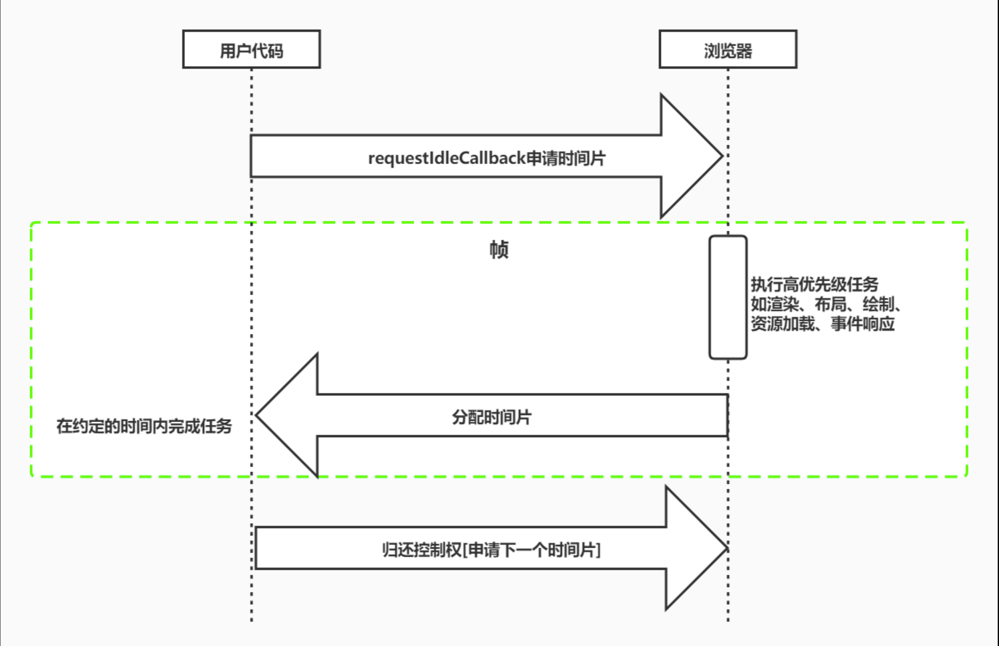
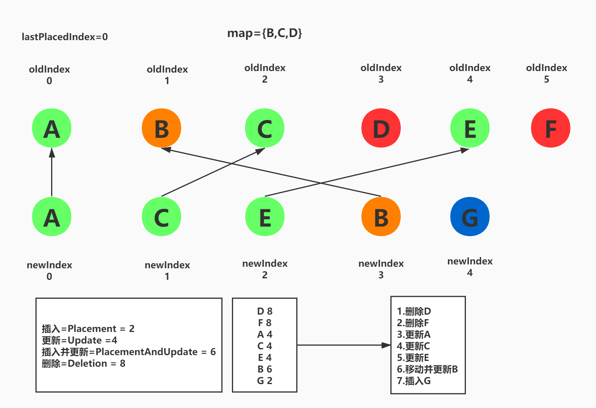
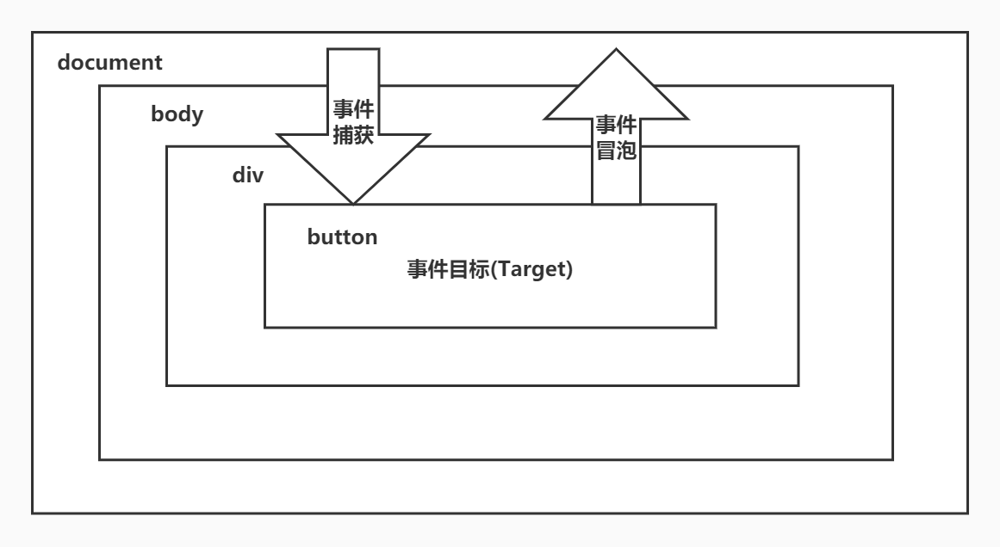
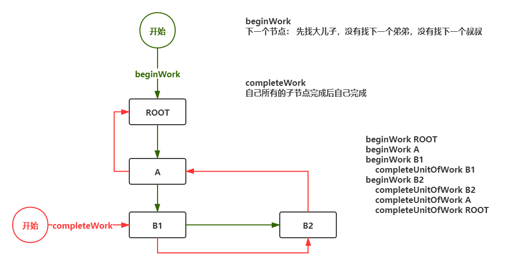
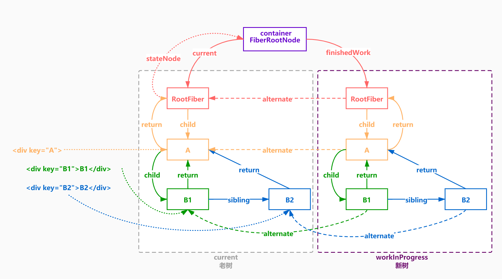
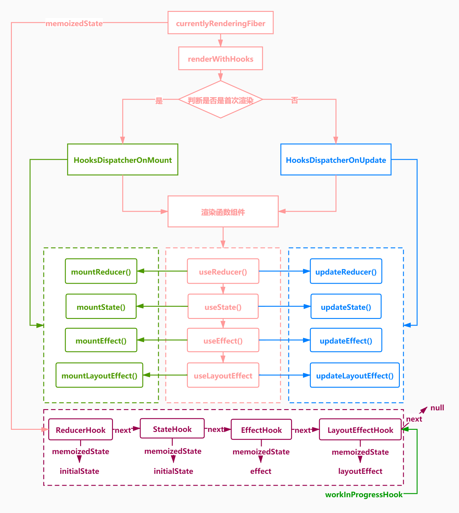

<!--
 * @Author: cc
 * @LastEditTime: 2022-08-11 11:26:18
-->

## React 源码实现

<br/>

## 📦 安装依赖

```shell
npm i
```

## ⌨️ 运行：

```shell
 npm run dev
```

---

## React

- react 包含 createElement 的核心

* shared 存放各个公共模块的公用方法和变量

* scheduler 实现了优先调度功能

* react-reconciler 提供协调器的功能

* react-dom 提供了渲染到 DOM 的功能

---

## React 渲染过程

快速响应->异步可中断(Fiber)+增量更新(dom diff)

- 性能瓶颈 Js 执行时间过长

  浏览器的刷新频率假设为 60hz，大概 (1 秒/60)16.6 毫秒更新一次，而 js 的线程和渲染线程是相斥的，如果 js 执行任务时间超过 16.6 毫秒，就会导致掉帧，解决方案就是 React 利用空闲时间进行更新，不影响渲染进行渲染。

- 帧

  每个帧的开头包含样式计算、布局和绘制，javaScript 执行 js 引擎和页面渲染在同一个渲染线程 GUI 和 js 执行是相斥的(因为 js 可以修改 dom)，所以利用 requestIdleCallback(由于兼容性，react 使用 MessageChannel+requestAnimationFrame 模拟) 在每一帧的空闲时间执行任务



---

## DomDiff

- DomDiff 的过程其实就是老的 Fiber 树 和 新的 jsx 对比生成新的 Fiber 树 的过程

- 单节点

  1.新旧节点 type 和 key 都不一样，标记为删除

  2.如果对比后发现新老节点一样的，那么会复用老节点，复用老节点的 DOM 元素和 Fiber 对象
  再看属性有无变更 ，如果有变化，则会把此 Fiber 节点标准为更新

  3.如果 key 相同，但是 type 不同，则不再进行后续对比了，
  直接把老的节点全部删除


- 多节点

  1.如果新的节点有多个的话
  我们经过二轮遍历
  第一轮处理更新的情况 属性和类型 type 的更新 更新或者说保持 不变的频率会比较高
  第二轮处理新增 删除 移动 的情况

```javaScript
  <ul>
    <li key="A">A</li>
    <li key="B">B</li>
    <li key="C">C</li>
    <li key="D">D</li>
    <li key="E">E</li>
    <li key="F">F</li>
    </ul>
    /*************/
    <ul>
    <li key="A">A-NEW</li>
    <li key="C">C-NEW</li>
    <li key="E">E-NEW</li>
    <li key="B">B-NEW</li>
    <li key="G">G-NEW</li>
  </ul>
  // 如果第一轮遍历的时候，发现key不一样，则立刻跳出第一轮循环
  // key不一样，说明可能有位置变化，更新A

  //第二轮循环，新建map={"B":"B","C":"C","D":"D","E":"E","F":"F"}，可以复用的节点标记为更新，从map中删除，然后map={"D":"D","F":"F"}，还没有被复用的fiber节点，等新的jsx数组遍历完之后，把map中的所有节点标记为删除，再更新，然后移动，记录第一轮的lastPlaceIndex，最小的oldIndex移动，最后插入新元素。
```



---

## 事件合成

- React16 版本为冒泡到到 document 上执行，所以导致和浏览器表现不一致(17 之后没问题了，因为挂到 root 上了)

```javaScript
  // element.addEventListener(event, function, useCapture) useCapture === true ? '捕获' : '冒泡'，默认冒泡
  // e.preventDefault() 阻止事件默认行为
  // onClickCapture 捕获 onClick 冒泡
  // React16由于会冒泡到docuemnt上执行，所以会导致最后show为false
    componentDidMount(){
      this.setState({
        show:false
      })
    }
    handleClick = (event)=>{
      // event.nativeEvent.stopProgation(); // 不再向上冒泡了，但是本元素剩下的函数还会执行，也就是React16的话，依然会执行
      // event.nativeEvent.stopImmediateProgation(); // 阻止监听同一事件的其他事件监听器被调用，阻止后续事件代理到docuemnt上，可以解决React16合成事件的问题
      this.setState({
        show:true
      })
    }
    <button onClick={this.handleClick}></button>
    {this.state.show && <a>显示</a>}
```

---

## setState 是同步还是异步？

- 新版本 React18 全部都是异步批量处理，之前版本两种同步和异步，React17 中的 setTimeout 和 promise 是同步，钩子函数中是异步

* React18 使用 createRoot，所以在 Promise 或者 setTiemout 也可以批量更新，不用使用 unstable_batchedUpdates 了,render 为同步模式(legacy)，createRoot 为并发模式(concurrent)

- React 在执行 setState 的时候会把更新的内容放入队列

- 在事件执行结束后会计算 state 的数据，然后执行回调

- 最后根据最新的 state 计算虚拟 DOM 更新真实 DOM

* 优点

  1.为保持内部一致性，如果改为同步更新的方式，尽管 setState 变成了同步，但是 props 不是

  2.为后续的架构升级启用并发更新，React 会在 setState 时，根据它们的数据来源分配不用的优先级，这些数据来源有：事件回调句柄，动画效果等，再根据优先级并发处理，提升渲染性能

  3.setState 设计为异步，可以显著提升性能(非合成事件和钩子函数当中是同步的，例如 Promise 中就是同步)，使用 batchedUpdates 可以已经批量更新

```javaScript
    this.setState({ count: this.state.count + 1 });
    console.log(this.state.count); // 批量更新所以是0
    this.setState({ count: this.state.count + 1 }, () => {
      console.log(this.state.count); // 批量更新之后会立即执行 1
    });
    setTimeout(() => {
      this.setState({ count: this.state.count + 1 });
      console.log(this.state.count); // setTimeout不受批量更新限制，所以为 1
    });
    unstable_batchedUpdates(() => {
      // 同步批量
      setTimeout(() => {
        this.setState({ count: this.state.count + 1 });
        console.log(this.state.count); // 1
      });
    });
    setTimeout(() => {
      this.setState({ count: this.state.count + 1 });
      console.log(this.state.count); // React18不用unstable_batchedUpdates也会同步批量所以是 1
        this.setState({ count: this.state.count + 1 });
      console.log(this.state.count); // React18不用unstable_batchedUpdates也会同步批量所以是 1
    });
```

## 

---

## 父与子组件生命周期执行顺序

- 组件的调用顺序都是先父后子,渲染完成的顺序是先子后父。 组件的销毁操作是先父后子，销毁完成的顺序是先子后父

## 

---

## Fiber 树

- Fiber 是一个执行单元，每执行一次任务，React 会检查现在还剩多少时间，如果没有就交出控制权



- beginWork 方法进行深度优先遍历，调用 reconcileChildren 方法，构建 fiber 树，while 循环深度优先所有的儿子，然后 while 结束通过调用 completeUnitWork 方法往上遍历 sibling

* current Fiber 树当渲染完毕后会生成一个 current Fiber 树

* workInProgress fiber 树在 render 阶段，会基于 current 树创建新的 workInProgress fiber 树赋值给 current Fiber 树

* workInProgress fiber 树的每个节点会有一个 alternate 指针指向 current 树赋给 current Fiber 树

## 

---

### 首次渲染

- 一个组件对应一个 Fiber，一个 Fiber 中单链表记录多个 hook,mountWorkInProgress 用来构建 hooks 的单项链表，currentLyRenderingFiber.memoizedState 是一条单项链表用来记录 hook,{memoizedState:'',queue:null,next:next:null},memoizedState 用来记录自己的状态，queue 自己的更新队列，环形链表，next 下一个更新



---

## 组件更新

- hook 并不能写在 if 里，因为要保持 hook 更新时一致


---

## 循环链表

- react 源码中用于组件更新(dispatchAction) 核心

* 链表是另一种形式的链表存储结构

* 它的特点是最后一个节点的指针区域指向头节点，整个链表形成一个环，永远指向最后一个更新

```javaScript
  // pedding.next指向第一个第一个更新，更新顺序是不变的，成环状
  function dispatchAction(queue,action){
    const update = {action,next:null};
    const pedding = queue.pedding;
    if(pedding == null){
      update.next = update;
    }else{
      update.next = pedding.next;
      pedding.next = update;
    }
    queue.pedding = update;
  }
  //队列
  let queue = {padding:null};
  dispatchAction(queue,'action1')
  dispatchAction(queue,'action2')
  dispatchAction(queue,'action3')
  // pedding: { action: 'action3', next: { action: 'action1', next: [Object] } }
  const peddingQueue = queue.pedding;
  // 源码中的遍历环形链表
  while(peddingQueue){
    let first = peddingQueue.pedding;
    let update = first;
    do{
       console.log(update) // action1 action2 action3
       update = update.next;
    }while(update !== first){}
  }
```

---

参考链接 [React 技术解密](https://react.iamkasong.com/) https://react.iamkasong.com/
