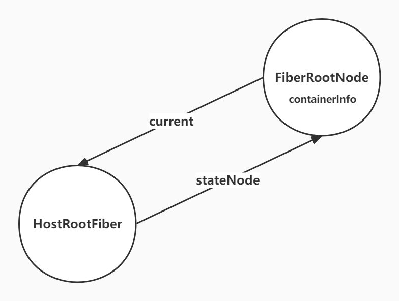
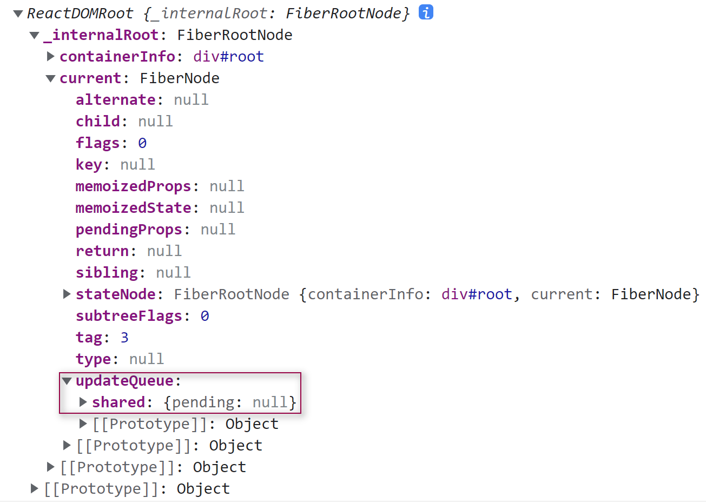

<!--
 * @Author: changcheng
 * @LastEditTime: 2023-08-02 21:53:02
-->

### createRoot

确定渲染的根节点，同时调用`createFiberRoot`，创建 Fiber 的根节点，FiberRootNode = containerInfo,它的本质就是一个真实的 DOM 节点，div#root，
其实就是一个真实的 DOM 节点

```javaScript
// div#root
function ReactDOMRoot(internalRoot) {
  this._internalRoot = internalRoot;
}
// 创建根节点
export function createRoot(container) {// div#root
  // 创建Fiber的根节点
  const root = createContainer(container);
  // 增加事件监听
  listenToAllSupportedEvents(container);
  return new ReactDOMRoot(root);
}
export function createContainer(containerInfo) {
   // 创建Fiber的根节点
  return createFiberRoot(containerInfo);
}
// 创建根Fiber
export function createFiberRoot(containerInfo) {
  const root = new FiberRootNode(containerInfo);
  //HostRoot指的就是根节点div#root
  const uninitializedFiber = createHostRootFiber();
  //根容器的current指向当前的根fiber
  root.current = uninitializedFiber;
  //根fiber的stateNode,也就是真实DOM节点指向FiberRootNode
  uninitializedFiber.stateNode = root;
  // 初始化更新队列
  initialUpdateQueue(uninitializedFiber);
  return root;
}
function FiberRootNode(containerInfo) {
  this.containerInfo = containerInfo;//div#root
  //表示此根上有哪些赛道等待被处理
  this.pendingLanes = NoLanes;
  this.callbackNode = null;
  this.callbackPriority = NoLane;
  //过期时间 存放每个赛道过期时间
  this.expirationTimes = createLaneMap(NoTimestamp);
  //过期的赛道
  this.expiredLanes = NoLanes;
}

```

### initialUpdateQueue 函数进行初始更新队列

Fiber 的`updateQueue`链表会在`processUpdateQueue`函数中根据老状态和更新队列中的更新计算最新的状态。

```javaScript

export function createFiberRoot(containerInfo) {
  const root = new FiberRootNode(containerInfo);
  //HostRoot指的就是根节点div#root
  const uninitializedFiber = createHostRootFiber();
  //根容器的current指向当前的根fiber
  root.current = uninitializedFiber;
  //根fiber的stateNode,也就是真实DOM节点指向FiberRootNode
  uninitializedFiber.stateNode = root;
  initialUpdateQueue(uninitializedFiber);
  return root;
}

export function initialUpdateQueue(fiber) {
  //创建一个新的更新队列
  //pending其实是一个循环链接
  const queue = {
    baseState: fiber.memoizedState,//本次更新前当前的fiber的状态,更新会其于它进行计算状态
    firstBaseUpdate: null,//本次更新前该fiber上保存的上次跳过的更新链表头
    lastBaseUpdate: null,//本次更新前该fiber上保存的上次跳过的更新链尾部
    shared: {
      pending: null,
    },
  };
  fiber.updateQueue = queue;
}





```
