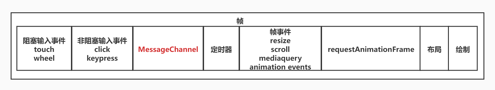

<!--
 * @Author: changcheng
 * @LastEditTime: 2023-10-09 21:50:58
-->
### messageChannel

1. React利用 MessageChannel模拟了requestIdleCallback，将回调延迟到绘制操作之后执行

2. 源码里会判断如果支持`messageChannel`用`messageChannel`，不支持就用`setTimeout`



```javaScript
var channel = new MessageChannel();
var port1 = channel.port1;
var port2 = channel.port2
port1.onmessage = function(event) {
    console.log("port1收到来自port2的数据：" + event.data);
}
port2.onmessage = function(event) {
    console.log("port2收到来自port1的数据：" + event.data);
}
port1.postMessage("发送给port2");
port2.postMessage("发送给port1");
```

### requestIdleCallback

`requestIdleCallback`用此方法，判断当前帧是否有空余时间，执行某个任务，在React中，可以模拟任务调度，根据任务优先级不同，根据浏览器剩余时间调度不同的任务，缺点就是浏览器兼容问题了。

```javaScript
   // 挂起任务
   function sleep(duration) {
      let time = Date.now();
      while (duration + time > Date.now()) {}
    }
    // 工作任务
    let works = [
      () => {
        console.log("A1开始");
        sleep(30); // 挂起30ms
        console.log("A1结束");
      },
      () => {
        console.log("B1开始");
        console.log("B1结束");
      },
      () => {
        console.log("B2开始");
        console.log("B2结束");
      },
    ];

    // 取出当前的第一个任务执行
    function performUnitWord() {
      let work = works.shift();
      work();
    }

    function workLoop(deadLine) {
      // deadLine.timeRemaining:函数的返回值表示当前空闲时间还剩下多少时间
      console.log("本帧剩余时间ms", parseInt(deadLine.timeRemaining()));
      while (
         // 如果有剩余时间或者过期了,过期的话 deadLine.timeout属性就会为true
        (deadLine.timeRemaining() > 0 || deadLine.timeout) &&
        works.length > 0
      ) {
        // 执行任务
        performUnitWord();
      }
      if (works.length > 0) {
        // 浏览器有空继续调用
        console.log(
          `只剩下${deadLine.timeRemaining()},时间片已经到期了，等待下次调度`
        );
        requestIdleCallback(workLoop);
      }
    }

    // 告诉浏览器有空闲时间执行任务，但是如果已经过期，不管有没有空，都帮我执行，执行方法就是requestIdleCallback(callBack,timeOut)
    requestIdleCallback(workLoop, { timeout: 1000 });
```
