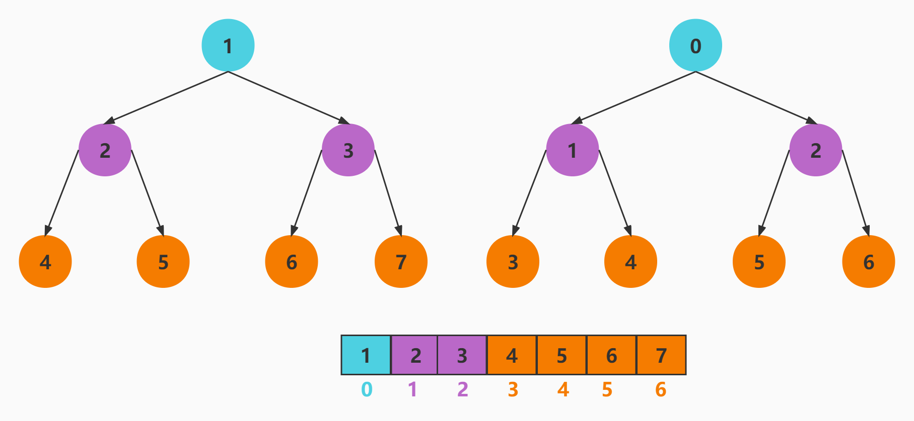

<!--
 * @Author: changcheng
 * @LastEditTime: 2023-10-09 21:27:27
-->
### 最小堆

1. 最小堆是一种经过排序的完全二叉树

2. 其中任一非终端节点的数据值均不大于其左子节点和右子节点的值

3. 根结点值是所有堆结点值中最小者

索引关系

+ 左子节点索引=(父节点索引*2)+1

+ 右子节点索引=左子节点索引+1

+ 父节点索引=(子节点索引-1)/2




### 为什要用最小堆

1. 这是因为在最小堆结构中，最小值就在第一个，React 可以快速的取出最小值。

2. React 为什么要取出最小值而不是最大值呢？我们可以这样设想，React 将更新任务拆成多个小任务，每个小任务的数据结构是一个带着 expirationTime 的对象，expirationTime 表示这个任务的过期时间，expirationTime 越小就表示过期时间越近，该任务的优先级就越高，取出最小值就相当于取出优先级最高的任务。


### 最小堆调度


1. peek() 查看堆的顶点

2. pop() 弹出堆的定点后需要调用siftDown函数向下调整堆

3. push() 添加新节点后需要调用siftUp函数向上调整堆

4. siftDown() 向下调整堆结构, 保证最小堆

5. siftUp() 需要向上调整堆结构, 保证最小堆

```javaScript
//scheduler/src/SchedulerMinHeap.js
/**
 * 添加一个节点
 * @param {*} heap 
 * @param {*} node 
 */
export function push(heap, node) {
  const index = heap.length;
  heap.push(node);
  siftUp(heap, node, index);
}
/**
 * 查看堆顶节点
 * @param {*} heap 
 * @returns 
 */
export function peek(heap) {
  return heap.length === 0 ? null : heap[0];
}
/**
 * 弹出堆顶节点
 * @param {*} heap 
 * @returns 
 */
export function pop(heap) {
  if (heap.length === 0) {
    return null;
  }
  // 取出第一个元素，也就是堆顶元素
  const first = heap[0];
  // 取出最后一个，也就是堆尾元素
  const last = heap.pop();
  if (last !== first) {
    // 堆顶，堆尾交换位置，然后从堆顶向下调整
    heap[0] = last;
    siftDown(heap, last, 0);
  }
  return first;
}
/**
 * 向上调整某个节点，让其在正确位置
 * @param {*} heap 最小堆
 * @param {*} node 节点
 * @param {*} i 索引
 * @returns 
 */
function siftUp(heap, node, i) {
  let index = i;
  while (index > 0) {
    // 拿到父的索引 (子节点-1)/2和这个向右移是等价的，这种写法好处是直接取整
    const parentIndex = index - 1 >>> 1;
    // 拿到父节点
    const parent = heap[parentIndex];
    // 父节点比子节点大
    if (compare(parent, node) > 0) {
      // 把儿子的值给父索引
      heap[parentIndex] = node;
      // 把父亲的值给子索引
      heap[index] = parent;
      // 让index = 父索引
      index = parentIndex;
    } else {
      // 子节点比父节点大
      return;
    }
  }
}
/**
 * 向下调整某个节点，让其在正确位置
 * @param {*} heap 最小堆
 * @param {*} node 节点
 * @param {*} i 索引
 * @returns 
 */
function siftDown(heap, node, i) {
  let index = i;
  const length = heap.length;
  // 类似于二分查找，但是这里是排序
  const halfLength = length >>> 1;
  while (index < halfLength) {
    // 左索引
    const leftIndex = (index + 1) * 2 - 1;
    // 左子节点
    const left = heap[leftIndex];
    // 右索引
    const rightIndex = leftIndex + 1;
    // 右节点
    const right = heap[rightIndex];
    // 比较进行移动 index
    if (compare(left, node) < 0) {
     // 右节点比左节点小，父节点和右节点进行交换
      if (rightIndex < length && compare(right, left) < 0) {
        // 当前索引为右节点
        heap[index] = right;
        // 右索引设置为父节点
        heap[rightIndex] = node;
        // 索引等于右索引
        index = rightIndex;
      } else {
        // 当前索引设置为左节点
        heap[index] = left;
        // 左索引设置为父节点
        heap[leftIndex] = node;
        // 索引等于左索引
        index = leftIndex;
      }
    // 右节点小于父节点
    } else if (rightIndex < length && compare(right, node) < 0) {
      // 当前索引为右节点
      heap[index] = right;
      // 右索引为父节点
      heap[rightIndex] = node;
      // 索引设置为右索引
      index = rightIndex;
    } else {
      return;
    }
  }
}
function compare(a, b) {
  const diff = a.sortIndex - b.sortIndex;
  return diff !== 0 ? diff : a.id - b.id;
}
```

```javaScript
const { push, pop, peek } = require('./SchedulerMinHeap');
let heap = [];
let id = 1;
push(heap, { sortIndex: 1,id:id++ });
push(heap, { sortIndex: 2,id:id++  });
push(heap, { sortIndex: 3,id:id++ });
console.log(peek(heap));
push(heap, { sortIndex: 4 });
push(heap, { sortIndex: 5 });
push(heap, { sortIndex: 6 });
push(heap, { sortIndex: 7 });
console.log(peek(heap));
pop(heap);
console.log(peek(heap));
```